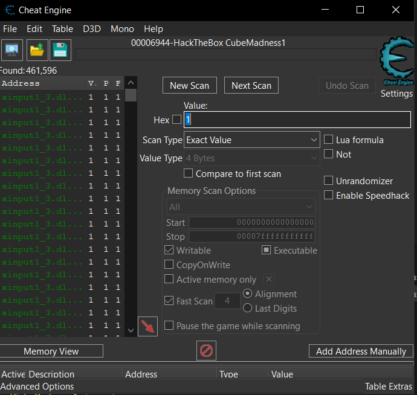
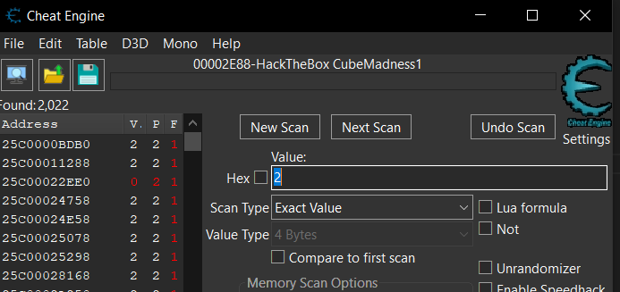
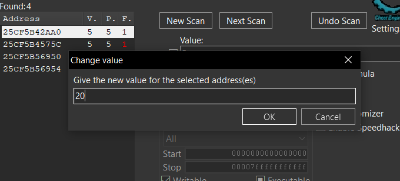
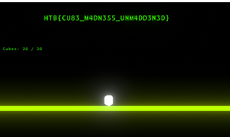

# Game Pwning CTF Challenge: CubeMadness1

## Challenge Description
Gotta collect them all.

We are provided with a game in this challenge.

## Analysis

### Initial Game Exploration
Let's run it and see what we need to do.

It is a simple Unity game where we need to collect **20 points**. However, on the map there are only **6 cubes**.

This means we will have to use **Cheat Engine** in order to manipulate the memory and modify the cube values.

## Exploitation

### Step 1: Initial Memory Scan
Let's get one cube in the game.

We will go into Cheat Engine, select our game process and scan for value `1`.

### Step 2: Narrow Down Memory Addresses
Then we will get another cube in the game.

We will go into Cheat Engine and select the value `2`.

### Step 3: Iterative Filtering
We will repeat this until we only have a couple of values and modify their values like in the next picture:

### Step 4: Flag Retrieval
We see that now we have 20 cubes and the flag is revealed:

## Solution Summary

### Memory Manipulation Process
1. **Collect cubes naturally** to establish baseline values
2. **Use Cheat Engine** to scan for current cube count
3. **Filter memory addresses** by collecting more cubes and scanning for new values
4. **Narrow down** to the correct memory address storing the cube count
5. **Modify the value** to 20 to meet the win condition
6. **Retrieve the flag** displayed in-game

### Tools Used
- **Cheat Engine**: Memory scanning and modification tool
- **Unity Game**: Target application for memory manipulation

### Key Technique
**Memory Address Filtering**: Progressive scanning technique where you:
- Scan for initial value
- Change the value in-game
- Filter previous results for new value
- Repeat until you isolate the correct memory address

---

**Challenge Type:** Game Pwning / Memory Manipulation  
**Tool Used:** Cheat Engine  
**Technique:** Memory Address Filtering and Value Modification  
**Target:** Unity Game Engine