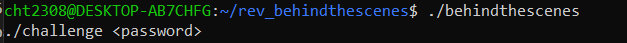
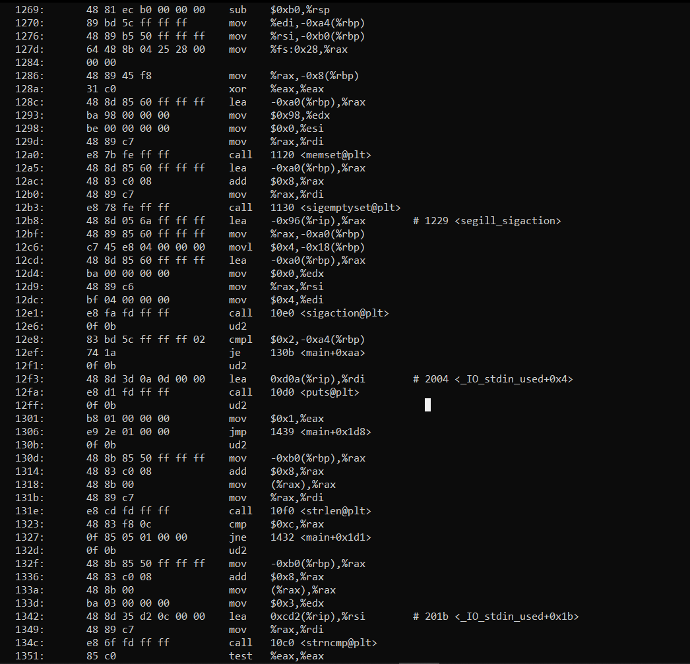
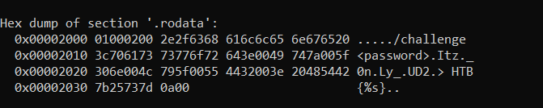

# Reversing CTF Challenge: SpookyPass (Behind the Scenes)

## Challenge Description
After struggling to secure our secret strings for a long time, we finally figured out the solution to our problem: Make decompilation harder. It should now be impossible to figure out how our programs work!

In this challenge we are provided with another binary file.

## Analysis

### Initial File Inspection
Let's first figure out what type of file it is by typing:
```bash
file behindthescenes
```

**Result:**
```
behindthescenes: ELF 64-bit LSB pie executable, x86-64, version 1 (SYSV), dynamically linked, interpreter /lib64/ld-linux-x86-64.so.2, BuildID[sha1]=e60ae4c886619b869178148afd12d0a5428bfe18, for GNU/Linux 3.2.0, not stripped
```

### Running the Executable
Another executable, let's try running it to figure out what we should do.

**Result:**



We are prompted with instructions to send the password as args when running the binary.

### Assembly Analysis
Let's dump the object and check the ASM instructions:



As we can see from the assembly code:
```assembly
131e:       e8 cd fd ff ff          call   10f0 <strlen@plt>
1323:       48 83 f8 0c             cmp    $0xc,%rax
1327:       0f 85 05 01 00 00       jne    1432 <main+0x1d1>
132d:       0f 0b                   ud2
```

The program checks firstly if the password provided has the length **12**. This is a good clue - the password should have 12 characters.

### Anti-Debugging Measures
It seems like the password is stored in the file, but we can't debug the program because of `sigaction` and `ud2` instructions which prevent debugging.

### Extracting the Password
Let's read the `.rodata` section:
```bash
readelf -x .rodata behindthescenes
```

**Result:**



As we can see, we found a password! If we arrange the characters correctly, we get: `Itz_0nLy_UD2` which confirms it is correct (12 characters as expected).

## Solution
We call the program with the discovered password:
```bash
./behindthescenes Itz_0nLy_UD2
```

And we should get the flag.

---

**Key Takeaways:**
- The binary uses anti-debugging techniques (`ud2` instruction, `sigaction`)
- Password length validation (12 characters)
- Password stored in scrambled form in `.rodata` section
- Required to pass password as command line argument