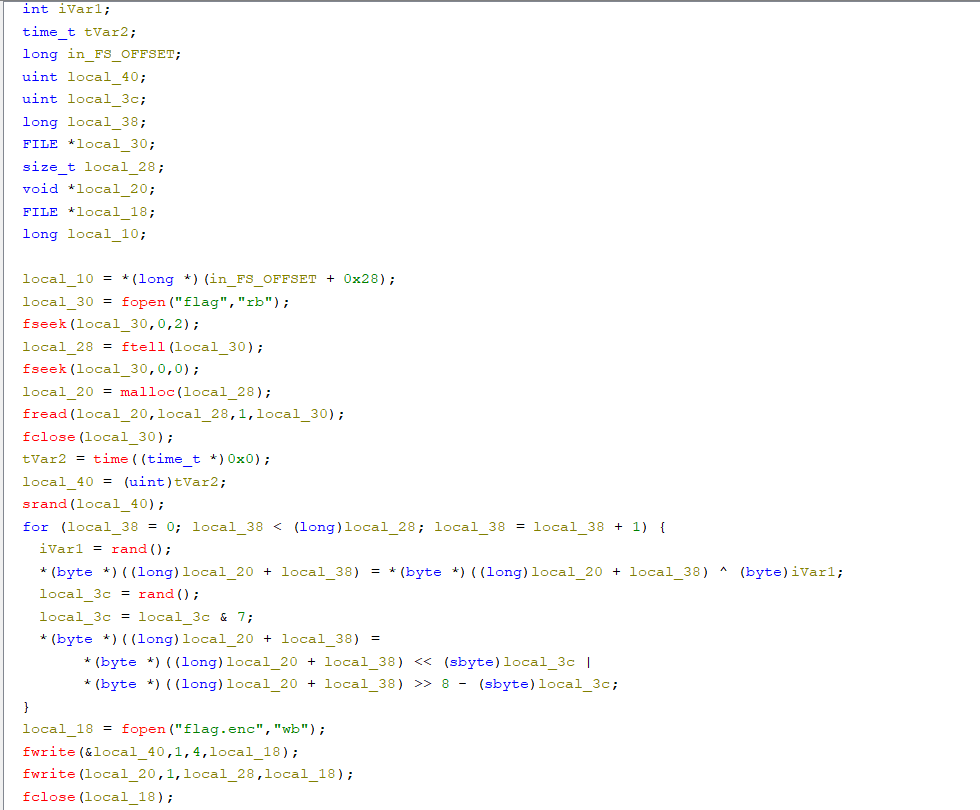

# Reversing CTF Challenge: Simple Encryptor

## Challenge Description
On our regular checkups of our secret flag storage server we found out that we were hit by ransomware! The original flag data is nowhere to be found, but luckily we not only have the encrypted file but also the encryption program itself.

In this challenge we are provided with a binary and a `flag.enc` encrypted file.

## Analysis

### Initial Binary Inspection
First of all, let's see what kind of file is the binary by executing:
```bash
file encrypt
```

**Result:**
```
encrypt: ELF 64-bit LSB pie executable, x86-64, version 1 (SYSV), dynamically linked, interpreter /lib64/ld-linux-x86-64.so.2, BuildID[sha1]=0bddc0a794eca6f6e2e9dac0b6190b62f07c4c75, for GNU/Linux 3.2.0, not stripped
```

### Initial Investigation
We tried getting the strings and reading the `.rodata` section. We managed to find that the program reads the flag from a file and outputs it encrypted in `flag.enc`, but nothing more.

### Ghidra Decompilation
We will go into Ghidra and decompile the binary into C code to see what we are dealing with.

**The decompiled program:**



## Code Analysis

Let's analyze what happens line by line:

### File Reading Section
```c
local_30 = fopen("flag","rb");
fseek(local_30,0,2);
local_28 = ftell(local_30);
fseek(local_30,0,0);
```

- `local_30`: Stores the pointer to the file
- The pointer is moved to the last element with `fseek`
- `local_28`: Gets the file size using `ftell`
- `fseek` puts the pointer right back to the first position

### Memory Allocation
```c
local_20 = malloc(local_28);
fread(local_20,local_28,1,local_30);
fclose(local_30);
```

Memory is allocated and file content is read into `local_20`.

### Random Seed Initialization
```c
tVar2 = time((time_t *)0x0);
local_40 = (uint)tVar2;
srand(local_40);
```

- `tVar2`: Gets the current time in seconds from Unix epoch
- `local_40`: Casts it to `uint`
- Random number generator is seeded with `local_40`

### Encryption Algorithm
```c
for (local_38 = 0; local_38 < (long)local_28; local_38 = local_38 + 1) {
    iVar1 = rand();
    *(byte *)((long)local_20 + local_38) = *(byte *)((long)local_20 + local_38) ^ (byte)iVar1;
    local_3c = rand();
    local_3c = local_3c & 7;
    *(byte *)((long)local_20 + local_38) =
         *(byte *)((long)local_20 + local_38) << (sbyte)local_3c |
         *(byte *)((long)local_20 + local_38) >> 8 - (sbyte)local_3c;
}
```

Here the encryption is happening:
1. **XOR Operation**: A random number is generated and the current byte is XORed with the random value
2. **Bit Rotation**: Another random number is generated and masked to 0-7 for bit rotation
3. **Left Rotation**: The byte is rotated left by that many positions

### File Output
```c
local_18 = fopen("flag.enc","wb");
fwrite(&local_40,1,4,local_18);
fwrite(local_20,1,local_28,local_18);
fclose(local_18);
```

- A new file is opened (`flag.enc`)
- **CRITICAL**: The seed is written as the first 4 bytes
- The encrypted flag is written after that
- The file is closed

## Exploitation

### Key Insight
The **critical vulnerability** is that the random seed used for encryption is stored as the first 4 bytes of the encrypted file!

### Decryption Strategy
1. **Extract the seed** from the first 4 bytes of `flag.enc`
2. **Use the same seed** to generate the identical random sequence
3. **Reverse the encryption operations** in the opposite order

### Reading the Seed
```c
// Read entire file
unsigned char* data = malloc(file_size);
fread(data, 1, file_size, f);
fclose(f);

// Extract seed from first 4 bytes
unsigned int seed = *(unsigned int*)data;
```

### Reverse Encryption Function
```c
void reverse_obfuscation(unsigned char* data, int length, unsigned int seed) {
    srand(seed);
    
    for (int i = 0; i < length; i++) {
        // Generate same random sequence
        int iVar1 = rand();
        int local_3c = rand();
        local_3c = local_3c & 7;
        
        // Reverse rotation (right rotate instead of left)
        data[i] = (data[i] >> local_3c) | (data[i] << (8 - local_3c));
        
        // Reverse XOR (XOR is its own inverse)
        data[i] = data[i] ^ (unsigned char)iVar1;
    }
}
```

### Decryption Process
1. **Right rotation** instead of left rotation to reverse the bit shift
2. **XOR with the same random value** (since XOR is its own inverse)
3. **Use identical random sequence** by seeding with the extracted seed

## Solution Summary

The ransomware made a critical mistake by storing the encryption seed in the encrypted file itself. This allows us to:

1. **Extract the seed** from the first 4 bytes of `flag.enc`
2. **Reproduce the exact random sequence** used during encryption
3. **Reverse the operations** (rotation and XOR) to recover the original flag

The full exploit can be found in the repository.

---

**Vulnerability Type:** Predictable Random Number Generator + Seed Exposure  
**Key Technique:** Deterministic PRNG Reversal  
**Critical Flaw:** Seed stored in encrypted output  
**Tools Used:** Ghidra, GDB