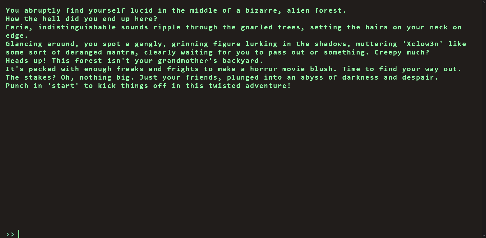
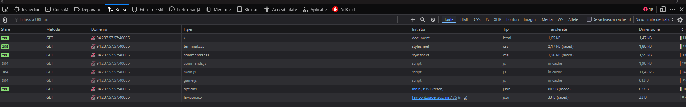

# Web CTF Challenge: Dimensional Escape Quest

## Challenge Description
Embark on the "Dimensional Escape Quest" where you wake up in a mysterious forest maze that's not quite of this world. Navigate singing squirrels, mischievous nymphs, and grumpy wizards in a whimsical labyrinth that may lead to otherworldly surprises. Will you conquer the enchanted maze or find yourself lost in a different dimension of magical challenges? The journey unfolds in this mystical escape!

This time we have a web-related CTF challenge.

## Analysis

### Initial Interface
When we enter the site we have the following interface:



Just some nonsense writing prompting for a game.

### Developer Console Investigation
Let's check the developer console for clues.

We will start by analyzing the requests in the **Network** tab:



The `options` fetch seems interesting, let's analyze the response from it.

### API Response Analysis
The response from the GET request is:
```json
{
  "allPossibleCommands": {
    "1": [
      "HEAD NORTH",
      "HEAD WEST",
      "HEAD EAST",
      "HEAD SOUTH"
    ],
    "2": [
      "GO DEEPER INTO THE FOREST",
      "FOLLOW A MYSTERIOUS PATH",
      "CLIMB A TREE",
      "TURN BACK"
    ],
    "3": [
      "EXPLORE A CAVE",
      "CROSS A RICKETY BRIDGE",
      "FOLLOW A GLOWING BUTTERFLY",
      "SET UP CAMP"
    ],
    "4": [
      "ENTER A MAGICAL PORTAL",
      "SWIM ACROSS A MYSTERIOUS LAKE",
      "FOLLOW A SINGING SQUIRREL",
      "BUILD A RAFT AND SAIL DOWNSTREAM"
    ],
    "secret": [
      "Blip-blop, in a pickle with a hiccup! Shmiggity-shmack"
    ]
  }
}
```

### Key Finding
We see we get a **secret** option, that has to be the option which gets us the flag!

## Solution
We can now:
1. Type `start` to start the game
2. Input the secret option: `"Blip-blop, in a pickle with a hiccup! Shmiggity-shmack"`
3. Get the flag

---

**Key Takeaways:**
- Web challenge disguised as a text-based adventure game
- Hidden API endpoint reveals secret commands
- Network tab analysis revealed the solution
- Secret command bypasses the normal game flow

**Flag:** `[Insert flag here after using the secret command]`