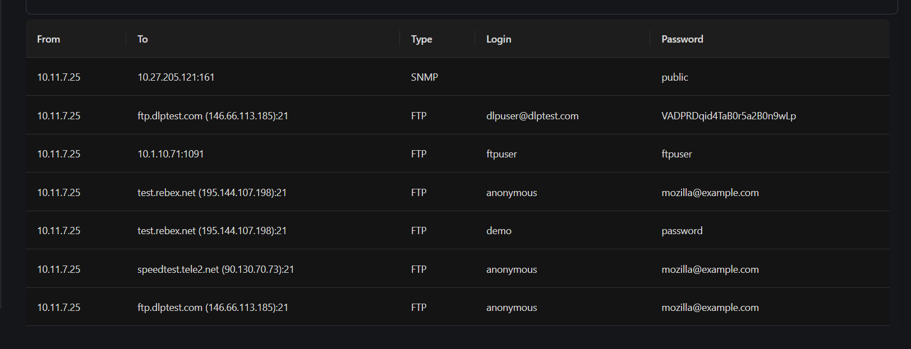

# Challenge: victim

## Description
In the reconnaissance process, a hacker managed to save a piece of data generated by his victim (file.pcap). Between multiple destinations, you need to identify vulnerable services on these hosts. The funny thing is that some authentication information will help you to capture the flag.

## Initial Analysis

We are provided with a pcap file named `file.pcap`. We will get that file right into a pcap analyzer to see if we can extract some things.

### Credential Discovery

Pcap analyzer managed to find some credentials and we also have a hint about auth information so we will note them down.

Nothing else was found so we will analyze it manually.

## Manual Analysis

After some analysis I searched for the hex value `50 4B` which is the magic bytes value for a ZIP header and we found:

a zip that has a `flag.txt` file inside.

## Solution

The zip is password protected so I tried to open it with the credentials found earlier.

**`VADPRDqid4TaB0r5a2B0n9wLp`** worked, unzipped the file and got us the flag.