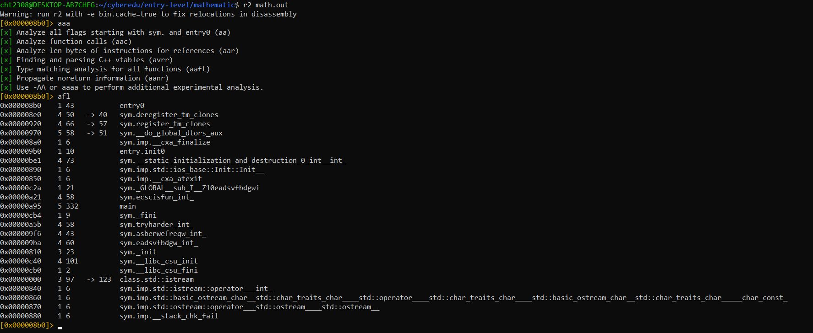
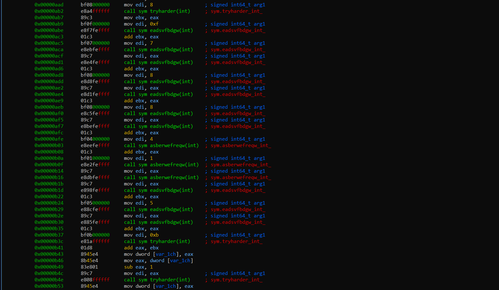
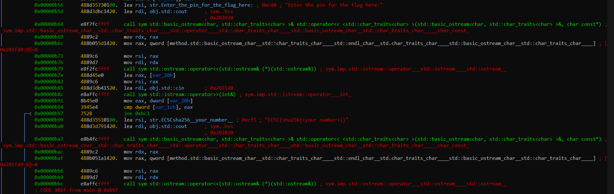
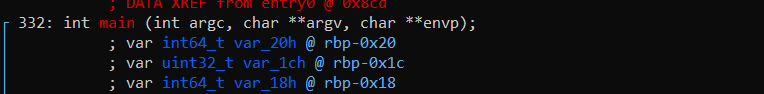
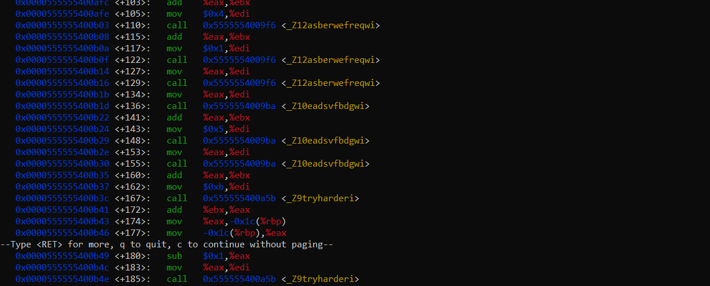
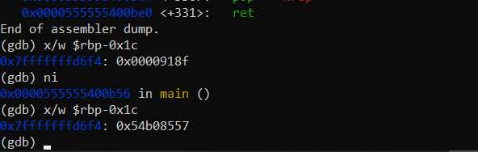
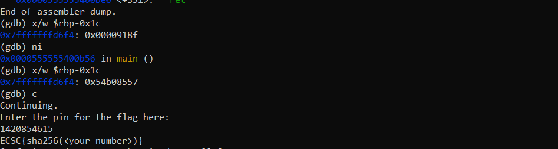

# Challenge: Mathematics

**Description:** Are you good at math?

In this challenge we are provided with a 64-bit binary executable.

We run the file and we are prompted with: `Enter the pin for the flag here:` and it awaits for input.

Let's start analyzing the binary to see the logic inside. We will use radare2.

## Static Analysis with Radare2

First we will analyze the file entries by prompting `aaa` and then `afl` to see the binary functions:

We will go into the main function and see the logic there with `pdf@main`.

We can see that several computing functions are called:

And the result is compared with our pin that we input:

## Dynamic Analysis Plan

As we don't see any anti-debugging protections, we can set a breakpoint after the computing functions, read the value computed and then input it to get the flag.

The important instruction is `cmp 1_varch, eax`. The `eax` register will contain the value that we input and `1_varch` will contain the computed value.

As we see in the image, `1_varch` is at `rbp - 0x1c`, so from there we will need to get the value.

## Dynamic Analysis with GDB

To do that we will use GDB.

We will run `gdb ./math.out` and set a breakpoint in main with: `break main`. This is needed so when we disassemble main we will see the runtime addresses of every instruction.

As we can see, we need to set a breakpoint after: `0x0000555555400b53` where the computation ends, so the computed value is held in the variable at `rbp-0x1c`.

After we get to that instruction we simply read the value with: `x/w $rbp-0x1c`

And we get the hex value. We convert that to decimal and get the flag:

## Solution

The computed value in hex converts to the decimal PIN needed to retrieve the flag.