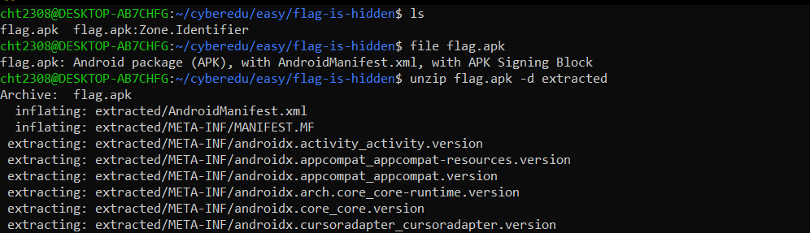
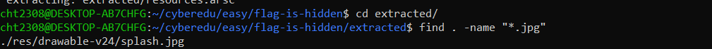
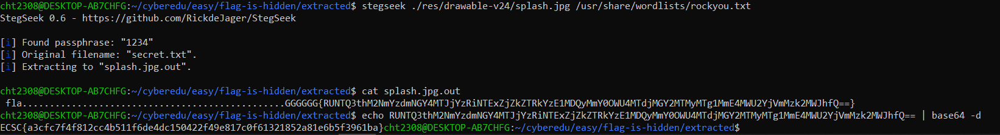

# flag-is-hidden

**Challenge Name:** flag-is-hidden  
**Description:** The flag is hidden in the attached file. Can you find it?  
**PS:** stegano tools can "rock your" score

## Writeup

We have a new steganography challenge. First, we are provided with an `.apk` file which we will extract to a directory:



Going through the extracted folder, we try looking for photos by doing:
```bash
find . -name "*.png"
```

We see many photos. While trying to look for other photos, we see that there is one JPG:
```bash
find . -name "*.jpg"
```



From the hint, we will try to brute force it with `rockyou.txt` and see what we can extract:
```bash
stegseek ./res/drawable-v24/splash.jpg /usr/share/wordlists/rockyou.txt
```

We immediately find the password, see what the extracted file contains, base64 decode it, and get the flag:


