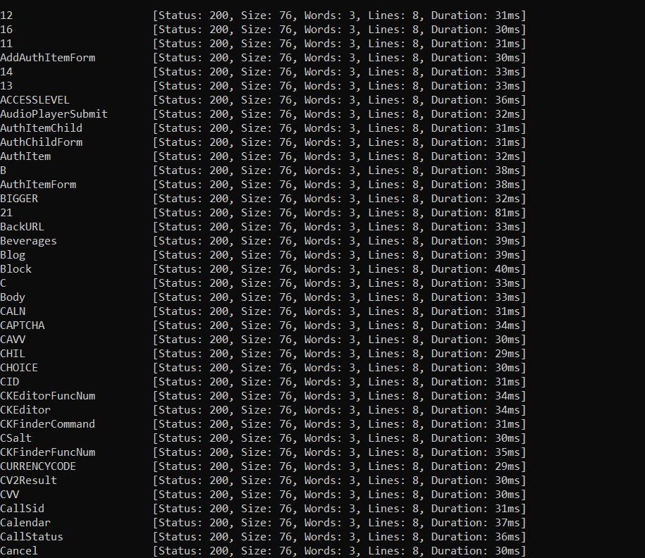
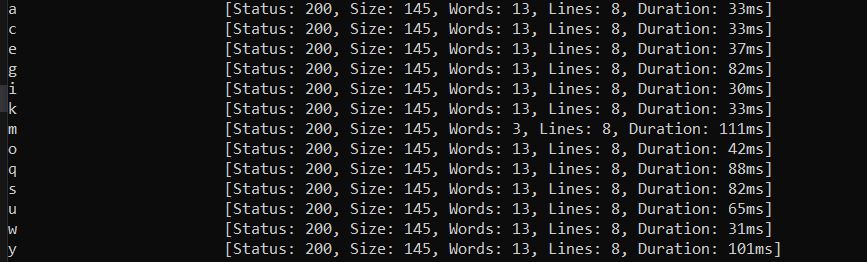
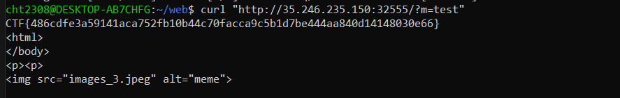

## Challenge: Reccon
**Type:** Web  
**Description:** I heard you like memes, so we had a surprise for you. Enjoy !!

### Initial Analysis
When we enter the site we only see a blank page with a meme:


No other endpoints, no clues in the responses and headers.

### Enumeration Process
After trying to enumerate the website, bust directories and other techniques we tried to search for params. To do that we used the burp-params.txt wordlist and the ffuf tool.

### Parameter Fuzzing - First Attempt
When we first run:
```bash
ffuf -u "http://35.246.235.150:32555/?FUZZ=test" -w burp-parameter-names.txt -mc 200,301,302,401,403
```


We see that we got false positives for every param, each having size 76, so we will filter out by that size to only show params with size different of 76.

### Parameter Fuzzing - Filtered Results
```bash
ffuf -u "http://35.246.235.150:32555/?FUZZ=test" -w burp-parameter-names.txt -mc 200,301,302,401,403 -fs 76
```


As we see we got some params with the same size, but the parameter "m" has a different size so we will use it to see what the request returns.

### Flag Discovery
```bash
curl "http://35.246.235.150:32555/?m=test"
```

Running the command will give us the flag:


### Key Learning Points:
1. **Parameter Discovery**: Hidden GET parameters can reveal functionality
2. **Response Size Filtering**: Using `-fs` to filter false positives in ffuf
3. **Wordlist Selection**: Using appropriate wordlists like burp-parameter-names.txt
4. **Thorough Enumeration**: When directories fail, try parameter fuzzing

### Tools Used:
- **ffuf**: Fast web fuzzer for parameter discovery
- **burp-parameter-names.txt**: Common parameter wordlist
- **curl**: Testing discovered parameters

This challenge demonstrates the importance of comprehensive web enumeration beyond just directory busting!