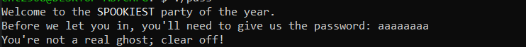

# Reversing CTF Challenge: SpookyPass

## Challenge Description
All the coolest ghosts in town are going to a Haunted Houseparty - can you prove you deserve to get in?

In this challenge we are provided with a binary file.

## Analysis

### Initial File Inspection
First thing to do is checking what type of file this is with:
```bash
file pass
```

**Result:**
```
pass: ELF 64-bit LSB pie executable, x86-64, version 1 (SYSV), dynamically linked, interpreter /lib64/ld-linux-x86-64.so.2, BuildID[sha1]=3008217772cc2426c643d69b80a96c715490dd91, for GNU/Linux 4.4.0, not stripped
```

### Running the Executable
Having an executable, let's try to run it:



As we run the program we are prompted to give the correct password. We have to find the password in the binary file for us to get the flag. The challenge is clear now.

### Binary Analysis
We will start by analyzing the binary:


As seen in the objdump, the program takes the input from the user (`0x1208`) and compares it with another string stored in the program (`0x1250`).

### Extracting the Password
As we know, the strings are stored in the section called `.rodata` so let's dump that section:
```bash
readelf -x .rodata pass
```

**Result:**


We can see the password clearly: `s3cr3t_p455_f0r_gh05t5_4nd_gh0ul5`

## Solution
Now, if we run the program and input this password, we will get the flag.

---