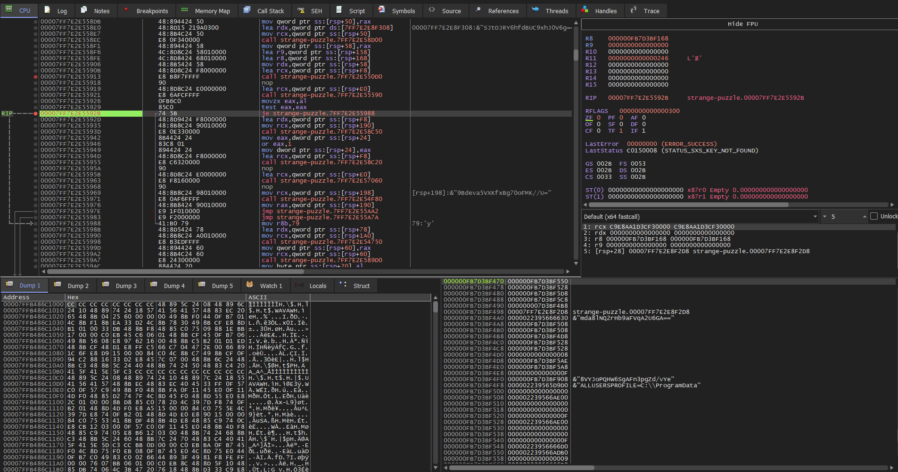
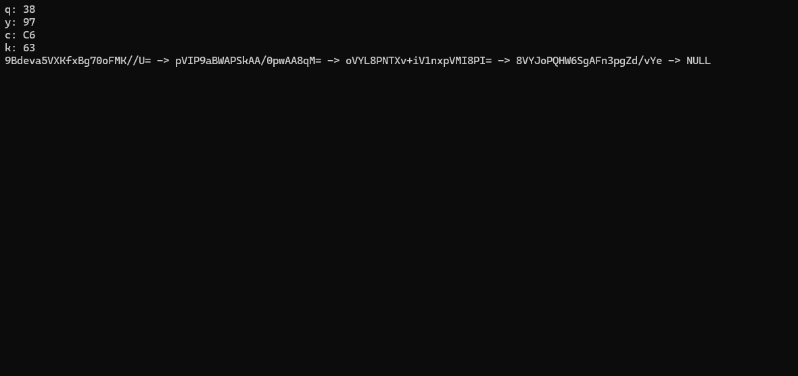
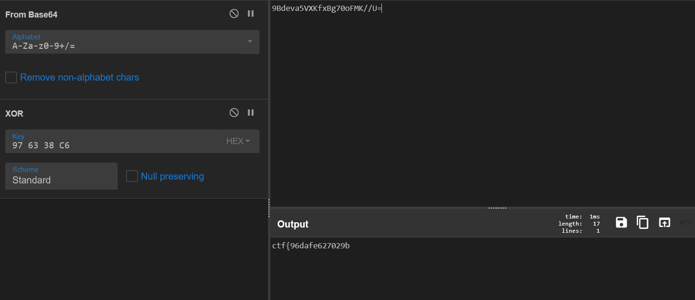

---

# Challenge Name: strange-puzzle

## Description

> We found this strange binary file. It seems to be some kind of puzzle. Can you connect the dots in pairs and uncover the hidden message? We suspect it holds a fragmented key to something valuable to you...

## Initial Analysis

We have a PE executable file. We will do a static analysis in **Ghidra** and maybe debug with **x64dbg**, but first, let's run it:

```console
./strange-puzzle.exe
q: empty
y: y
c: c
k: k
flag1 -> flag2 -> flag3 -> flag4 -> NULL

```

We can see some random characters, each pointing to each other and a structure that looks like a simply linked list. Now, we will go into Ghidra and statically analyze the binary so maybe we can identify some functions and rename them.

## Static Analysis

During the static analysis, I have found the following interesting functions:

* **offset 6810** -> `main` function
* **offset 5010** -> `key generator`
* **offset 43a0** -> `Crypto-memset`
* **offset 50d0** -> `decryptor`
* **offset 4d80** -> `init_meta_arr`
* **offset 8c20** -> `~basic_string<>`
* **offset 5710** -> `insert_q`
* **offset 5bf0** -> `insert_y`
* **offset 6110** -> `insert_c`
* **offset 6510** -> `insert_k`
* **offset 4a90** -> `qykc_printer`
* **offset 4550** -> `linked_list_printer`
* **offset 4f80** -> `free`
* **offset 4750** -> `lookup_key`
* **offset 5530** -> `anti-debug-check`

The renamed `main` function will look like this:

```cpp
int __cdecl main(int _Argc,char **_Argv,char **_Env) {
  // ... variable declarations ...
  
  // Anti-debug and decryption setup
  local_18 = DAT_14003c180 ^ (ulonglong)auStack_6e8;
  keyGenerator(local_28,local_38);
  
  // Initial Decryptor Calls (Setup for the puzzle)
  decryptor(local_5c0,local_688,local_28,(longlong)local_38);
  init_meta_arr(local_138,extraout_RAX);
  // ... (Repeated for other segments) ...

  // The Main Puzzle Logic: Insertions
  bVar1 = see-anti-debug();
  local_6a0 = (undefined4)CONCAT71(extraout_var,bVar1);
  
  // Insert Q
  local_608 = (_String_val<> *)FUN_140006d90(local_610,local_138);
  insert_q(local_260,local_608,(longlong)DAT_14003f348);
  FUN_140004490(DAT_14003f418,local_260);
  
  // Insert Y
  local_5f8 = (_String_val<> *)FUN_140006d90(local_600,local_1b8);
  insert_y(local_280,local_5f8,(longlong)DAT_14003f348);
  FUN_140004490(DAT_14003f418,local_280);
  
  // Insert C
  local_5e8 = (_String_val<> *)FUN_140006d90(local_5f0,local_b8);
  insert_c(local_2a0,local_5e8,(longlong)DAT_14003f348);
  FUN_140004490(DAT_14003f418,local_2a0);
  
  // Insert K
  local_5d8 = (_String_val<> *)FUN_140006d90(local_5e0,local_238);
  insert_k(local_2c0,local_5d8,(longlong)DAT_14003f348);
  FUN_140004490(DAT_14003f418,local_2c0);
  
  // Printers
  qykcprinter((longlong)DAT_14003f348);
  linkedListPrinter(DAT_14003f418);
  
  // ... Cleanup ...
  return iVar2;
}

```

The code is too heavy for full static analysis, so we will jump into **x64dbg**.

## Dynamic Analysis

First, we will analyze what the 4 main decryption functions decrypt. Going into the debugger and setting a breakpoint before the decryptor function returns, running it 4 times yields these SHA-256 hashes:

1. `3f355c177a1aae6de43e1fd3072f8daf27d18d1fe42a8eea`
2. `6423fc41b3444fa8930a35c032397b78aded15cebd481e71`
3. `62927f2bbab721edf107f1f5ef3baf08bbbd841d3c9f33c1`
4. `0c73cd972119d5be1fec8fa2bd40175a732ec91c0399423d`

Now, we will analyze the `insert` functions to see how the insertions are made and why some of them are failing (returning "empty"). We can already suppose that in order to get the flag, we need to fill all the letters.

### Analyzing `insert_q`

Going into `insert_q`, we see some anti-debug checks:

```cpp
while( true ) {
   bVar1 = FUN_140006ef0(&local_b0,&local_98);
   if (!bVar1) break;
   // ... code checking for processes ...
   decryptor(local_50,local_148,local_20,(longlong)local_30);
   // ...
}

```

Here, multiple strings like `ghidra.exe` and `ollydbg.exe` are decrypted, so we will jump further with the **Hide Debugger** option in x64dbg (or patch the jump).

The critical part is here:

```cpp
if (cVar2 == '\0') {
    // Dependency Check: Looks for 'y' inside insert_q
    local_128 = lookupKey(param_3,local_110,'y');
    local_168 = FUN_1400089d0(local_128);
    ~basic_string<>(local_110);
    
    if (local_168 == '\0') {
        // Failure path -> "empty"
        FUN_140008c50(param_1,local_90); 
        // ... cleanup ...
    }
    else {
        // Success path -> Decrypts flag part!
        FUN_1400048e0(param_3,0x79);
        base(param_2,param_1); 
        // ... cleanup ...
    }
}
else {
    // Failure path -> "empty"
    FUN_140008c50(param_1,local_90);
    // ...
}

```

This is the whole logic that we need to bypass. As we can see, in order to insert **q**, it checks if **y** is already inserted. Since `insert_q` runs *before* `insert_y`, this is always false.

We need to bypass this check. We will set a breakpoint at the ASM instruction:

```assembly
14000592b 74 5b     JZ      LAB_140005988

```

Like in this picture: 



Now, watching the assembly, we see that we need to make the jump. In order to do that, we will **modify the ZF flag register to 1**, step over, and then we will be inside the `if`.

We do the same at the second `if` (the dependency check) to force execution into the `else` condition:

```cpp
else {
    FUN_1400048e0(param_3,0x79); // The filling function
    base(param_2,param_1);
    // ...
}

```

The function that makes the filling is at offset `48e0`. Just execute the function and go next into the `insert_y` function.

For `insert_y`, `insert_k`, and `insert_c`, the logic is the same: we need to reach the `48e0` offset function (the Updater) to fill the place. To do that, just watch the assembly instructions, breakpoint at jump instructions (`JZ`/`JNZ`), and see if you need to jump or step over to force the path to `48e0`.

## The Solution

After all 4 functions are executed with our patches, we can simply step over the `qykc_print` and `list_printer` functions and watch the console:



As we see in the picture, the output completely changed. The 4 letters now display a Hex Key and the flags are some Base64 encoded strings.

We go to **CyberChef** and make the following setup:

1. **From Base64**
2. **XOR** (with the Key displayed by the 4 letters: `97 63 38 C6`)

As we can see in the picture, part of the flag is being decrypted. We will do that for all the Base64 strings displayed, concatenate the parts, and we will have the final flag.

