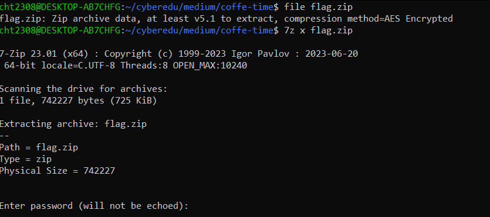
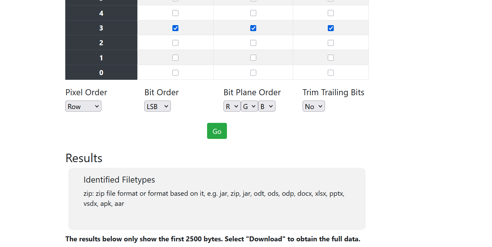
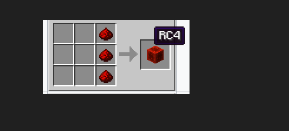
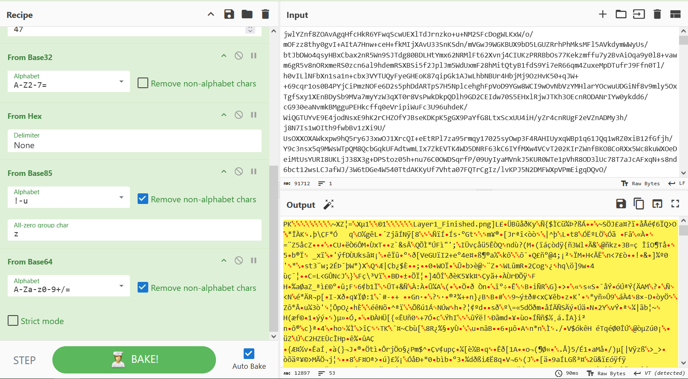

# Coffee Time

**Challenge Name:** Coffee time  
**Description:** Someone's been sending some suspicious data underneath our noses. Your task is to get to the bottom of this. Also, ignore the title... though, you might need a cup or two.

## Writeup

Today we have a steganography challenge. First, we have a zip file. We try extracting it and see that it is password protected.



In order to find the password, I used `fcrackzip`:
```bash
fcrackzip -D -p /usr/share/wordlists/rockyou.txt -u flag.zip
```

After we found the password, we can see that we have a `flag.png` file. Let's look at it.


No clues here, so let's try some tools to see what we can find.

After using StegOnline, we found a zip file at bit 3 LSB:



Also, we found something interesting while running `zsteg`:


It is in binary form. After numerous research, I found the key: **3317**, by applying the following ciphers: from binary → from base85 → ROT13 → from hex → from base64.


We will note this.

Now let's look into the zip file that we got. Here we have 2 pictures:
- `crafting.png`:  
  
  
- `key.png`:  
  

There may be some hints in the photos. For example, in the crafting photo we will try to extract bits 0,1,2 from channels R,G.

We couldn't find anything by extracting that from `crafting.png`, nor by extracting 0,1,2 from color B from `key.png`, so we will try doing that on `flag.png`, the first image.

And we have found another zip file:


And from the clue in `key.png`, we found some binary data:


This may also be an RC4 key.

Applying the same cipher order as we did for the first key, we get:

**Key:** `33179FE2474DF368B9D29E3355FE27EF4CA07CD063582E01C75822C54D2CD6EC1DEE5C01885E6CE3C775436749349AEEA4E93F97F2606DEF7EEA7CC0F4E60F40`

We see indeed that this is the real key and the `zsteg` tool was not giving us the full key. We know that this is an RC4 key. Let's analyze the last zip that we got.

Here we only see a file named `2`:


Opening it with Notepad++, we see some base64 encoded text:


We will get that and put it into CyberChef.

The base64 didn't get us anywhere, so we also added RC4-Drop on top of that as we have an RC4 key.

After going through the rabbit hole, we found the cipher list: from base64 → RC4-Drop → ROT47 → from base32 → from hex → from base85 → from base64. We found a zip file:



Here we got another PNG file and the zip is password protected. The zip password is the RC4 key found earlier.

This is the picture that we got:


We see that we have a strange chunk of pixels, so we will cut them separately from the picture and then try to extract some data from there.

We carefully cut the chunk in Paint and copy it into another window. After that, we save the PNG file.

After various attempts in row 7 on channel RGB, LSB encoding, we find a zip:


We download the zip and have the flag in plaintext in the notepad inside.