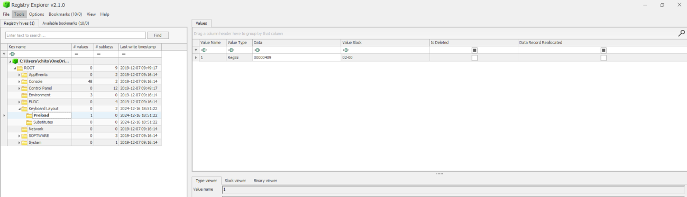
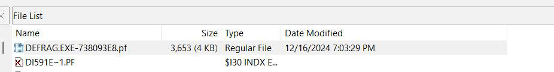
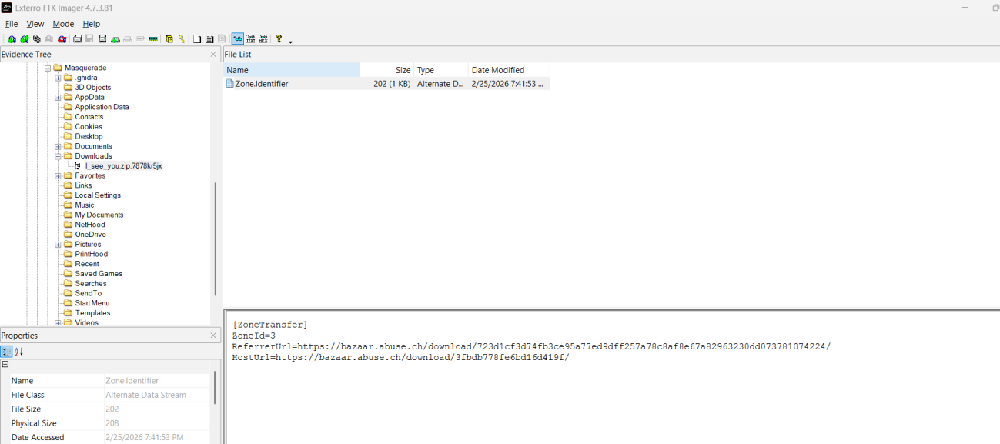
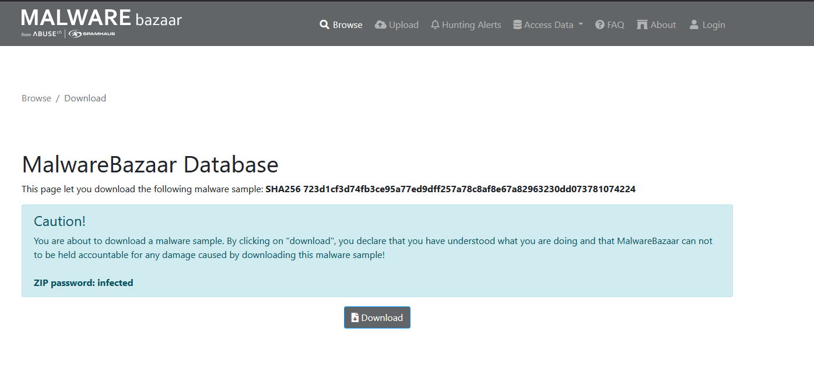
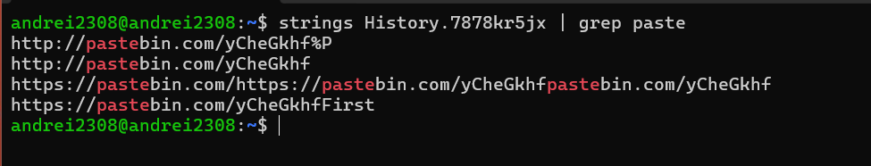
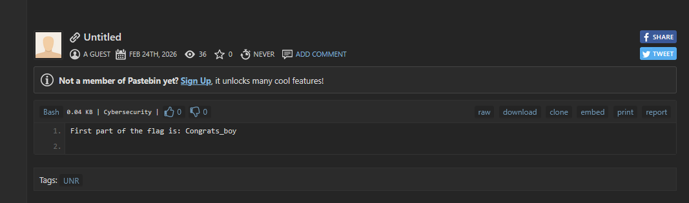
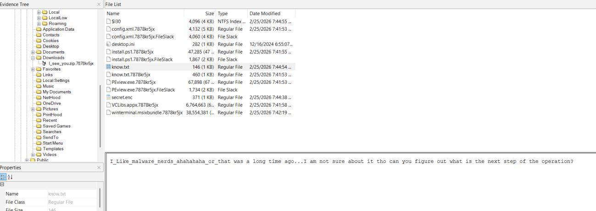
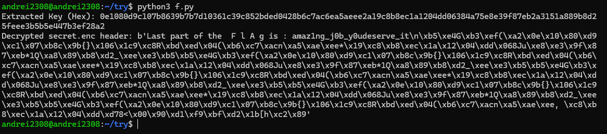

# UNR Tokio — Forensics Challenge Writeup

## Flag

```
UNR{English_2024-12-16 19:03:29_723d1cf3d74fb3ce95a77ed9dff257a78c8af8e67a82963230dd073781074224_Congrats_boy_amaz1ng_j0b_y0udeserve_it}
```

## Summary

The challenge presents a split raw NTFS forensic image (UNRTokio.001–030) of a Windows FLARE VM malware analysis workstation belonging to user **Masquerade**. The system had been compromised by both **Black Basta** and **Ryuk** ransomware, with most user files encrypted (`.7878kr5jx` extension). The flag is composed of five parts: the keyboard layout language (`English`), the UTC modification timestamp of the DEFRAG prefetch file (`2024-12-16 19:03:29`), the SHA-256 hash of the malware sample downloaded from Malware Bazaar (`723d1cf3...`), a hidden message found on a Pastebin page discovered through partially-recovered Chrome browser history (`Congrats_boy`), and a secret obtained by decrypting `secret.enc` on the Desktop using the contents of `know.txt` as the key (`amaz1ng_j0b_y0udeserve_it`).

## Detailed Walkthrough

### Part 1 — Keyboard Layout: `English`

The first part of the flag asks for the keyboard layout configured on the system. This is stored in the Windows registry under the user's `NTUSER.DAT` hive.

Navigate to the user profile at `C:\Users\Masquerade` and extract `NTUSER.DAT`. Open the registry key:

```
HKCU\Keyboard Layout\Preload
```

The only value present is `1` = `00000409`, which corresponds to the **English (United States)** keyboard layout. No other layouts are configured.



**ANS1 = `English`**

---

### Part 2 — DEFRAG Prefetch Timestamp: `2024-12-16 19:03:29`

The second part requires the modification timestamp of the DEFRAG command-line utility's prefetch file, in UTC.

Navigate to `C:\Windows\Prefetch` and locate the file:

```
DEFRAG.EXE-738093E8.pf
```

The file's **Modified** timestamp as shown in FTK Imager needs to be converted to UTC. The system timezone is determined from the SYSTEM registry hive at:

```
HKLM\SYSTEM\ControlSet001\Control\TimeZoneInformation
```

The `TimeZoneKeyName` value is **GTB Standard Time** (UTC+2). Taking the file's modification time and converting to UTC yields:

```
2024-12-16 19:03:29 UTC
```



**ANS2 = `2024-12-16 19:03:29`**

---

### Part 3 — Malware Sample Hash: `723d1cf3d74fb3ce95a77ed9dff257a78c8af8e67a82963230dd073781074224`

The third part is the SHA-256 hash of the malware sample that was downloaded onto the system.

In `C:\Users\Masquerade\Downloads`, there is a file named:

```
I_see_you.zip.7878kr5jx
```

The `.7878kr5jx` extension indicates it was encrypted by the BlackBasta ransomware after download. The original filename was `I_see_you.zip`.

The Chrome browser history (recovered in Part 4) reveals that the user visited **bazaar.abuse.ch** and downloaded a malware sample. The Malware Bazaar URL in the history contains the SHA-256 hash of the sample:

```
723d1cf3d74fb3ce95a77ed9dff257a78c8af8e67a82963230dd073781074224
```

This can be verified by looking up the hash on [Malware Bazaar](https://bazaar.abuse.ch), which confirms it as the `I_see_you.zip` sample.





**ANS3 = `723d1cf3d74fb3ce95a77ed9dff257a78c8af8e67a82963230dd073781074224`**

---

### Part 4 — Hidden Pastebin Message: `Congrats_boy`

The fourth part is a hidden string planted by the challenge author on an external Pastebin page. The key to finding it lies in the Chrome browser history.

Although most files on the system were encrypted by BlackBasta, the Chrome History SQLite database at:

```
C:\Users\Masquerade\AppData\Local\Google\Chrome\User Data\Default\History.7878kr5jx
```

is only **partially encrypted**. BlackBasta encrypts the first portion of files but leaves the rest intact. By extracting raw strings from the encrypted History file, browsing URLs are still recoverable.

Among the recovered URLs is:

```
http://pastebin.com/yCheGkhf
```

Visiting this Pastebin page reveals a paste created on **Feb 24th, 2026**, tagged with **UNR** and **Cybersecurity**, containing:

```
First part of the flag is: Congrats_boy
```





**ANS4 = `Congrats_boy`**

---

### Part 5 — Decrypted Secret: `amaz1ng_j0b_y0udeserve_it`

The fifth and final part requires decrypting an encrypted file on the Desktop.

On `C:\Users\Masquerade\Desktop`, two files are of interest:

- **`know.txt`** — contains the string: `I_Like_malware_nerds_ahahahaha_or_that was a long time ago...`
- **`secret.enc`** — an encrypted file (371 bytes)

The content of `know.txt` serves as the decryption key for `secret.enc`. Using it to decrypt the file reveals the final part of the flag:

```
amaz1ng_j0b_y0udeserve_it
```




**ANS5 = `amaz1ng_j0b_y0udeserve_it`**

---
