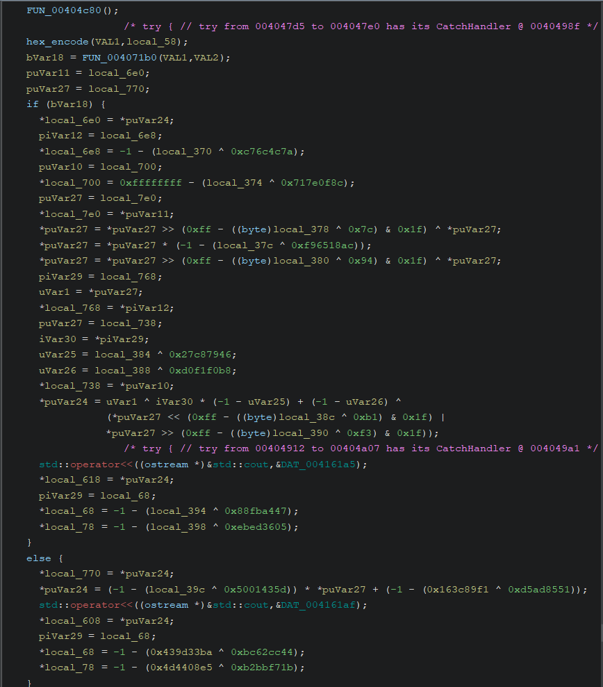
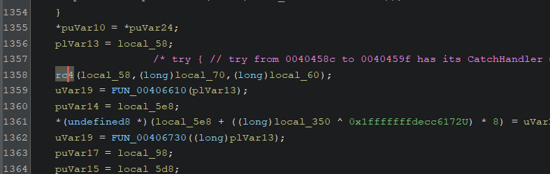
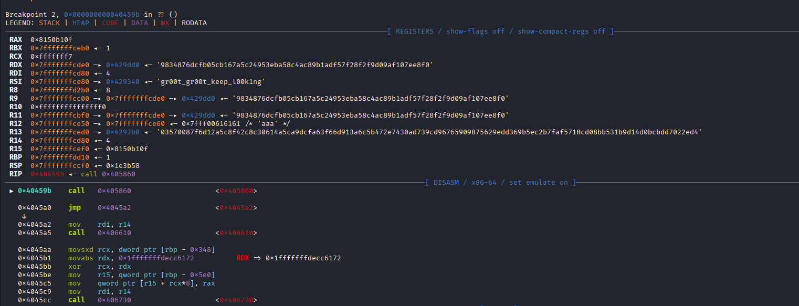
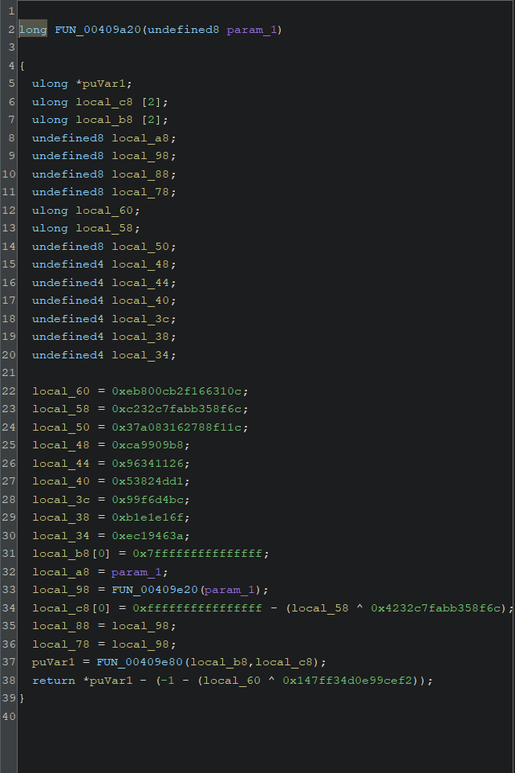
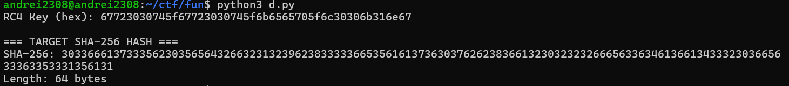
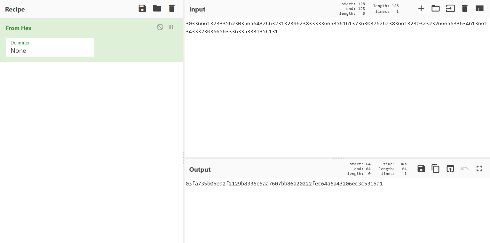

# Crack Me If You Can - CTF Writeup

## Challenge Overview

We are provided with a heavily obfuscated authentication system. The binary performs several transformations on our input and compares it against a hardcoded hash value.

## Initial Analysis

Starting from the comparison point, we can see an if/else statement indicating success or failure:



Our strategy is to work backwards from this comparison to understand the transformations applied to our input.

## Debugging and Discovery

By debugging the binary, we let the obfuscated strings decrypt themselves. We can observe the comparison between our transformed input and the expected hash.


### Register Values

From the debugger, we extract two crucial values:

- **r13** (expected hash): `03570087f6d12a5c8f42c8c30614a5ca9dcfa63f66d913a6c5b472e7430ad739cd96765909875629edd369b5ec2b7faf5718cd08bb531b9d14d0bcbdd7022ed4`
- **r14** (our transformed input): `0a5c55d2f9d5295adc11cf970111f5ca99c1a53236d811fac5e676b2140fd8389bcf230002d5557abbd339e1bc2d26ff044ac75ebb5c1f981683beeb830f29d5`

The value in **r13** is our target - this is what our input needs to produce after transformation.

## Reverse Engineering the Transformations

### Discovery 1: RC4 Encryption

Tracing back through the code, we find a function that implements the RC4 encryption algorithm:



To reverse RC4, we need to find the encryption key. Setting a breakpoint at the function call reveals:



**RC4 Key found**: `gr00t_gr00t_keep_l00king`

### Discovery 2: SHA-256 Hashing

Continuing to trace backwards, we find another function call:




Debugging into this function reveals characteristic SHA-256 initialization constants:
- `0x6a09e667`
- `0xbb67ae85`
- `0x3c6ef372`
- `0xa54ff53a`

This confirms that **SHA-256 hashing** is applied to the input.

### Discovery 3: Hex Encoding

The final transformation is **hex encoding** of the result.

## Transformation Chain

The complete transformation pipeline is:

```
Input → SHA-256 → RC4 Encryption → Hex Encode → Compare
```

## Exploitation Strategy

To recover the original password, we reverse these transformations:

1. **Hex decode** the target hash from r13
2. **Decrypt with RC4** using the discovered key
3. **Crack the SHA-256 hash** to get the original password

## Solution Script

Here's the script to reverse the RC4 encryption and obtain the SHA-256 hash:

```python
import hashlib
import base64

# RC4 implementation
def rc4_crypt(data, key):
    """Standard RC4 implementation"""
    S = list(range(256))
    j = 0

    # KSA (Key Scheduling Algorithm)
    for i in range(256):
        j = (j + S[i] + key[i % len(key)]) % 256
        S[i], S[j] = S[j], S[i]

    # PRGA (Pseudo-Random Generation Algorithm)
    i = j = 0
    result = []
    for byte in data:
        i = (i + 1) % 256
        j = (j + S[i]) % 256
        S[i], S[j] = S[j], S[i]
        K = S[(S[i] + S[j]) % 256]
        result.append(byte ^ K)

    return bytes(result)

# Found RC4 key
rc4_key = b"gr00t_gr00t_keep_l00k1ng"

print(f"RC4 Key (hex): {rc4_key.hex()}")

# Target ciphertext from r13
expected_hex = "03570087f6d12a5c8f42c8c30614a5ca9dcfa63f66d913a6c5b472e7430ad739cd96765909875629edd369b5ec2b7faf5718cd08bb531b9d14d0bcbdd7022ed4"
ciphertext = bytes.fromhex(expected_hex)

# Decrypt RC4 to get the SHA-256 hash
sha256_hash = rc4_crypt(ciphertext, rc4_key)

print(f"\n=== TARGET SHA-256 HASH ===")
print(f"SHA-256: {sha256_hash.hex()}")
print(f"Length: {len(sha256_hash)} bytes")
```

### Script Output

Running this script produces:



The output is hex-encoded. Using CyberChef to apply "From Hex" transformation:



**SHA-256 hash obtained**: `03fa735b05ed2f2129b8336e5aa7607bb86a20222fec64a6a43206ec3c5315a1`

## Cracking the SHA-256 Hash

We use **hashcat** with the **rockyou.txt** wordlist to crack the SHA-256 hash:

```bash
hashcat -m 1400 03fa735b05ed2f2129b8336e5aa7607bb86a20222fec64a6a43206ec3c5315a1 /usr/share/SecLists-master/Passwords/Leaked-Databases/rockyou.txt
```


**Password recovered**: `downwithhackerz`

## Getting the Flag

The final step is to compute the MD5 hash of the password:

```bash
echo -n "downwithhackerz" | md5sum
```

**Flag**: `ISMCTF{66e8a9183004e1493c66db98b63e9965}`

## Summary

This challenge required reverse engineering a multi-layer authentication system:

1. Identified the comparison point and target hash
2. Discovered RC4 encryption with key `gr00t_gr00t_keep_l00king`
3. Identified SHA-256 hashing via characteristic constants
4. Reversed the transformation chain: Hex decode → RC4 decrypt → SHA-256 crack
5. Used hashcat to recover the password `downwithhackerz`
6. Computed MD5 of the password to get the flag

**Tools Used**:
- GDB/Debugger for dynamic analysis
- Python for RC4 decryption
- CyberChef for hex conversion
- Hashcat for SHA-256 cracking
- rockyou.txt wordlist