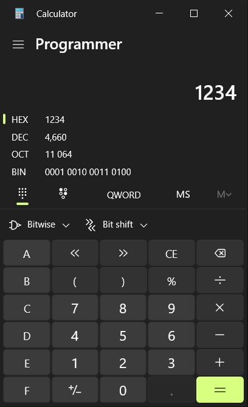

Here’s an enhanced version of your description, organized and polished for readability and better explanation. You can use this as the foundation for your CTF repository:

---

# **Challenge: fd.c**

### **Challenge Description**
In this challenge, we are provided with the following C code:

```c
#include <stdio.h>
#include <stdlib.h>
#include <string.h>

char buf[32];

int main(int argc, char* argv[], char* envp[]){
    if(argc < 2){
        printf("pass argv[1] a number\n");
        return 0;
    }
    int fd = atoi(argv[1]) - 0x1234;
    int len = 0;
    len = read(fd, buf, 32);
    if(!strcmp("LETMEWIN\n", buf)){
        printf("good job :)\n");
        system("/bin/cat flag");
        exit(0);
    }
    printf("learn about Linux file IO\n");
    return 0;
}
```

Our goal is to get the program to execute `system("/bin/cat flag")` and reveal the flag. To do this, we need to satisfy the conditions in the code and bypass the final `if` statement.

---

### **Analyzing the Code**
1. **Input Validation:**
   - The program expects one argument (`argv[1]`) in numeric form.
   - If no argument is passed, it will print:
     ```
     pass argv[1] a number
     ```

2. **`fd` Calculation:**
   - The program calculates `fd` (a file descriptor) as:
     ```c
     int fd = atoi(argv[1]) - 0x1234;
     ```
   - **`atoi(argv[1])`:** Converts the input string (`argv[1]`) to an integer.
   - **`0x1234`:** This is a hexadecimal constant equal to **4660** in decimal.
   - 

3. **`read(fd, buf, 32)`:**
   - The program reads **32 bytes** from the file descriptor `fd` into the buffer `buf`.

4. **Condition Check:**
   - The program compares the contents of `buf` with the string `"LETMEWIN\n"`:
     ```c
     if (!strcmp("LETMEWIN\n", buf))
     ```
   - If the contents match, it prints `"good job :)"` and executes:
     ```c
     system("/bin/cat flag")
     ```

---

### **Objective**
To capture the flag, we need to satisfy:
1. **`fd == 0`:** This ensures `read(fd, buf, 32)` reads from standard input (`stdin`).
   - This is achieved when:
     ```c
     atoi(argv[1]) - 0x1234 == 0
     ```
   - Simplifying:
     ```c
     atoi(argv[1]) == 0x1234
     ```

2. **Input the Correct String:**
   - After the program reads from `stdin`, we need to input:
     ```
     LETMEWIN
     ```

---

### **Solution Steps**
1. **Determine the Value of `argv[1]`:**
   - The program expects `atoi(argv[1]) == 0x1234`. Since `argv[1]` is passed as a decimal string, we need to convert `0x1234` (hexadecimal) to decimal:
     ```
     0x1234 = 4660 (decimal)
     ```

2. **Run the Program with the Correct Argument:**
   - Execute the program with `4660` as the argument:
     ```bash
     ./fd 4660
     ```

3. **Provide the Correct Input:**
   - The program will now read from standard input. Provide the string `"LETMEWIN"` followed by a newline (`\n`):
     ```
     LETMEWIN
     ```

4. **Capture the Flag:**
   - If the conditions are met, the program will print:
     ```
     good job :)
     ```
   - It will then execute `system("/bin/cat flag")`, revealing the flag.

---

### **Walkthrough**
1. **Run the Program Without Arguments:**
   ```bash
   ./fd
   ```
   Output:
   ```
   pass argv[1] a number
   ```

2. **Run the Program with the Correct Argument:**
   ```bash
   ./fd 4660
   ```
   The program waits for input.

3. **Provide the Correct Input:**
   ```
   LETMEWIN
   ```
   Output:
   ```
   good job :)
   <flag>
   ```

---

### **Key Takeaways**
- **Understanding `atoi`:** `atoi` converts a string into an integer, making it essential to convert hexadecimal values to decimal for correct input.
- **File Descriptor 0 (`stdin`):** The value `fd = 0` maps to standard input, allowing the program to read user input for further processing.
- **Hexadecimal Conversion:** Always convert hexadecimal values to decimal if the input is expected as a numeric string.

---

### **Additional Notes**
- If the program uses other file descriptors (e.g., for files or sockets), the approach may vary.
- Learn more about **Linux file I/O** and **system calls** to understand how `read()` and `system()` interact.

---