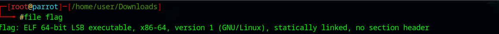
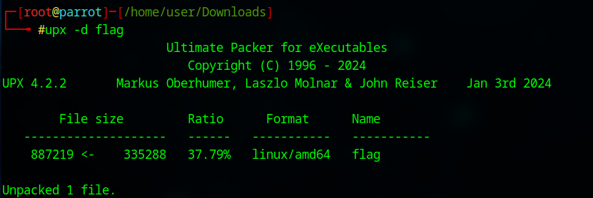

---

# **Challenge 4: Flag Binary**

### **Challenge Description**
For this challenge, we are provided with a binary file that can be downloaded from:  
[http://pwnable.kr/bin/flag](http://pwnable.kr/bin/flag)

The goal of this challenge is to **learn basic binary reverse engineering** techniques to extract the hidden flag.

---

## **Step-by-Step Solution**

### **Step 1: Analyze the File**
The first step when dealing with a binary file is to identify its type and check whether it is compressed, packed, or protected.

#### **Command**:
```bash
file flag
```

#### **Output** (example):
```
flag: UPX compressed, x86-64
```


#### **Analysis**:
The output indicates that the file is **packed with UPX**, a popular executable packer. Packed binaries are compressed to reduce size or obfuscate the content, and they must be unpacked before further analysis.

---

### **Step 2: Check for Embedded Strings**
Next, use the `strings` command to extract readable strings from the binary. This is a quick way to look for hints or information like the flag.

#### **Command**:
```bash
strings flag
```

#### **Output**:
- At this point, the output may contain very few readable strings or garbage data, as the file is still packed.
- However, scrolling to the bottom might reveal `UPX! UPX!`.

#### **Analysis**:
The `UPX! UPX!` string confirms that the binary is packed with UPX. We need to unpack it to proceed further.

---

### **Step 3: Unpack the Binary**
To unpack the binary, use the **UPX unpacking tool**.

#### **Command**:
```bash
upx -d flag
```

#### **Output**:
```
Ultimate Packer for eXecutables
Unpacked 1 file: flag
```

#### **Analysis**:
The binary has now been unpacked. This means we can analyze its original content without the obfuscation caused by packing.

---

### **Step 4: Recheck for Strings**
Now that the binary is unpacked, re-run the `strings` command to search for readable content, including any potential flags.

#### **Command**:
```bash
strings flag
```

#### **Expected Output**:
- The unpacked binary should now reveal readable strings. However, the flag may not be directly visible.

---

### **Step 5: Search for the Flag**
To filter for potential flag-related content, use the `grep` command to look for relevant keywords like `flag`.

#### **Command**:
```bash
strings flag | grep flag
```

#### **Output** (example):
```
FLAG{this_is_the_hidden_flag}
```

If the flag is not revealed:
1. Experiment with other keywords (e.g., `UPX` or other hints from the `strings` output).
2. Example:
   ```bash
   strings flag | grep UPX
   ```

#### **Analysis**:
The flag may be embedded in the binary but obfuscated in a specific way. If the above commands don't work, move to further analysis techniques like reverse engineering.

---

### **Optional: Decompile the Binary**
If the flag is not found using `strings`, the next step is to reverse engineer the binary to understand its behavior and locate the flag. Tools like `Ghidra` or `radare2` can be used.

#### **Using Ghidra**:
1. Load the binary into [Ghidra](https://ghidra-sre.org/).
2. Analyze the disassembled code to identify:
   - Hardcoded strings.
   - System calls (e.g., `printf`, `puts`, `system`).
   - Hidden logic where the flag might be generated or stored.

#### **Using Radare2**:
1. Open the binary in radare2:
   ```bash
   r2 -A flag
   ```
2. Analyze the functions:
   ```bash
   afl
   ```
3. Explore strings:
   ```bash
   iz
   ```

---

## **Final Steps**
1. After locating the flag using `strings`, `grep`, or reverse engineering:
   - Copy the flag in the required format (e.g., `FLAG{...}`).
2. Submit the flag to complete the challenge.

---

## **Key Takeaways**
- **File Analysis**:
  - Always begin by identifying the file type and format using tools like `file`.
- **Packed Binaries**:
  - If the file is packed (e.g., with UPX), unpack it first to reveal its true content.
- **String Extraction**:
  - Use `strings` to extract readable content and combine it with tools like `grep` to filter for relevant keywords.
- **Reverse Engineering**:
  - For more complex challenges, use tools like `Ghidra` or `radare2` to disassemble and analyze the binary.

---
