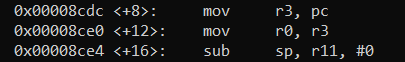
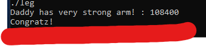

---

# **Challenge 8: LEG**

### **Challenge Overview**
This challenge involves a binary file with ARM assembly instructions and multiple key-returning functions. The goal is to reverse engineer the binary, extract the key values returned by three functions (`key1`, `key2`, and `key3`), and sum them to provide the correct input to unlock the flag.

---

## **Understanding the Code**

### **Challenge Code**
```c
#include <stdio.h>
#include <fcntl.h>

int key1() {
    asm("mov r3, pc\n");
}

int key2() {
    asm(
        "push   {r6}\n"
        "add    r6, pc, $1\n"
        "bx     r6\n"
        ".code   16\n"
        "mov    r3, pc\n"
        "add    r3, $0x4\n"
        "push   {r3}\n"
        "pop    {pc}\n"
        ".code  32\n"
        "pop    {r6}\n"
    );
}

int key3() {
    asm("mov r3, lr\n");
}

int main() {
    int key = 0;
    printf("Daddy has very strong arm! : ");
    scanf("%d", &key);

    if ((key1() + key2() + key3()) == key) {
        printf("Congratz!\n");
        int fd = open("flag", O_RDONLY);
        char buf[100];
        int r = read(fd, buf, 100);
        write(0, buf, r);
    } else {
        printf("I have strong leg :P\n");
    }

    return 0;
}
```

---

### **Challenge Breakdown**
1. **Objective**:
   - Extract the values returned by `key1`, `key2`, and `key3`.
   - Add these values together to calculate the input (`key`) required to unlock the flag.

2. **Key Assembly Features**:
   - ARM architecture is used.
   - The program involves ARM-specific concepts:
     - **PC (Program Counter)**: Holds the address of the next instruction.
     - **LR (Link Register)**: Stores the return address of a function.
     - **BX Instruction**: Branches to a new instruction and switches between ARM (32-bit) and Thumb (16-bit) modes.

3. **Steps**:
   - Disassemble the binary to analyze `key1`, `key2`, and `key3`.
   - Calculate the values returned by each function.
   - Add these values to determine the required input.

---

## **Reversing the Binary**

### **1. Analyzing `key1`**
The function:
```c
int key1() {
    asm("mov r3, pc\n");
}
```
- This instruction moves the **PC (Program Counter)** into `r3`, which is then returned.
- ARM architecture uses 32-bit instructions, meaning `PC` holds the address of the **next instruction**, typically 8 bytes ahead.

From the disassembly:
```
0x00008cd4 <key1>:   mov r3, pc
```
- The next instruction address is `0x00008ce4`.
- 

**`key1` Value**:
```
Key1 = 0x00008ce4
```

---

### **2. Analyzing `key3`**
The function:
```c
int key3() {
    asm("mov r3, lr\n");
}
```
- This instruction moves the **LR (Link Register)** into `r3`, which is then returned.
- **LR** stores the return address after the function call.

From the `main` function:
```
0x00008d7c <main>:   bl      0x8d20 <key3>
0x00008d84 <main>:   add     r2, r4, r3
```
- The `bl` (Branch and Link) instruction calls `key3`, storing the return address in `LR`.
- The return address is the next instruction: `0x00008d80`.

**`key3` Value**:
```
Key3 = 0x00008d80
```

---

### **3. Analyzing `key2`**
The function:
```c
int key2() {
    asm(
        "push   {r6}\n"
        "add    r6, pc, $1\n"
        "bx     r6\n"
        ".code   16\n"
        "mov    r3, pc\n"
        "add    r3, $0x4\n"
        "push   {r3}\n"
        "pop    {pc}\n"
        ".code  32\n"
        "pop    {r6}\n"
    );
}
```

**Execution Flow**:
1. **`push {r6}`**:
   - Pushes `r6` onto the stack.
   - Stack: `r6`.

2. **`add r6, pc, $1`**:
   - Adds `PC + 1` to `r6`.
   - This switches the architecture to Thumb mode (`PC`’s LSB becomes `1`).

3. **`bx r6`**:
   - Branches to `r6` and switches to Thumb mode (16-bit instructions).

4. **Thumb Mode**:
   - `mov r3, pc` sets `r3` to the next instruction’s address (4 bytes ahead): `0x00008d08`.
   - `adds r3, #4` increments `r3` to `0x00008d0c`.
   - `push {r3}` pushes `r3` onto the stack.
   - `pop {pc}` pops the value (`0x00008d0c`) into `PC`, branching execution to `0x00008d0c`.

5. **Back to ARM Mode**:
   - `pop {r6}` restores `r6` with the value `0x00008d0c` from the stack.
   - The function ends, returning `r6`.

**`key2` Value**:
```
Key2 = 0x00008d0c
```

---

## **Combining the Keys**

### **Summing the Keys**
The program checks if:
```c
key1() + key2() + key3() == key
```
From our analysis:
```
Key1 = 0x00008ce4
Key2 = 0x00008d0c
Key3 = 0x00008d80
```
Sum:
```
0x00008ce4 + 0x00008d0c + 0x00008d80 = 0x1A770
```

### **Convert to Decimal**
The required input is:
```
0x1A770 = 108,400
```

---

## **Solution**

### **Steps to Solve**
1. Run the program:
   ```bash
   ./leg
   ```
2. Input the calculated key:
   ```
   108400
   ```
3. The program will output the flag:
   ```
   Congratz!
   <flag>
   ```
   

---

## **Key Takeaways**
1. **ARM-Specific Concepts**:
   - Understanding `PC`, `LR`, and `BX` instructions is crucial.
   - Switching between ARM and Thumb mode affects instruction sizes.

2. **Disassembly Analysis**:
   - Breaking down the assembly step-by-step helps understand program behavior.

3. **Reverse Engineering Workflow**:
   - Disassemble the binary to extract logic.
   - Analyze function behavior to determine required inputs.
