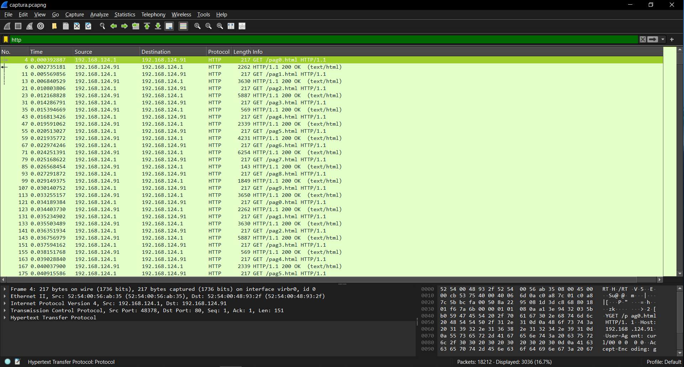
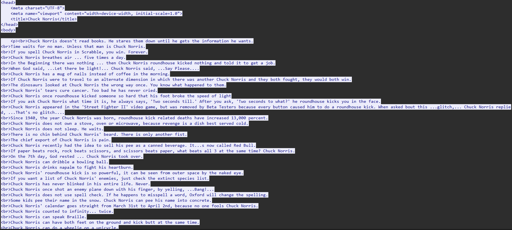
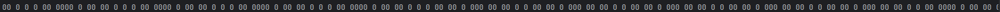
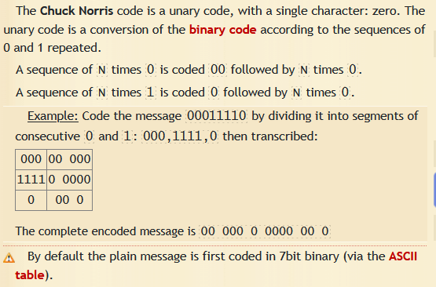
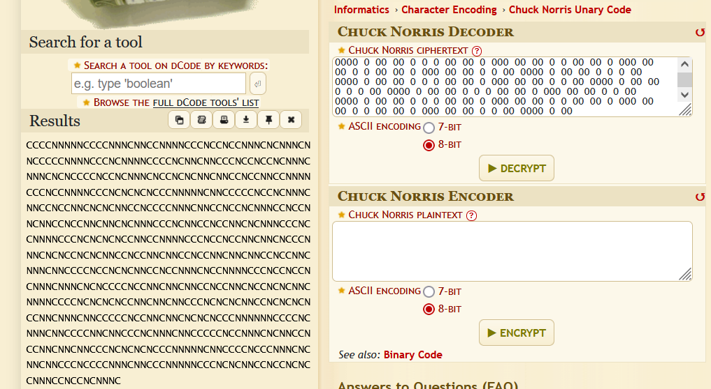
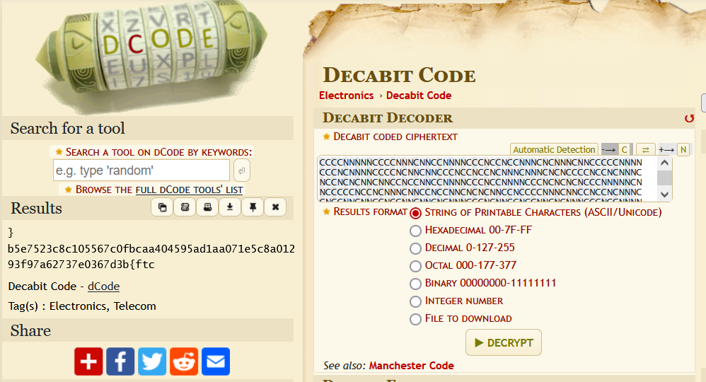

# CTF Challenge Write-up: exfill-very funny

In this challenge, we analyze a Wireshark capture file to extract hidden information from HTTP traffic.

## Initial Analysis

We begin by filtering HTTP requests and responses in the capture file.



From the filtered results, we observe multiple HTTP streams worth investigating further.

## HTTP Stream Analysis

Examining the HTTP headers reveals some interesting patterns:

```
GET /pag0.html HTTP/1.1
Host: 192.168.124.91
User-Agent: curl/00 0 0 0 0
Accept-Encoding: gzip, deflate, br
Accept: */*
Connection: keep-alive
HTTP/1.1 200 OK
Date: Tue, 18 Feb 2025 08:27:00 GMT
Server: Apache/2.4.58 (Ubuntu)
Last-Modified: Sat, 15 Feb 2025 06:28:01 GMT
ETag: "1025-62e28649ab2bf-gzip"
Accept-Ranges: bytes
Vary: Accept-Encoding
Content-Encoding: gzip
Content-Length: 1857
Keep-Alive: timeout=5, max=100
Connection: Keep-Alive
Content-Type: text/html
```

The content of the HTTP responses contains Chuck Norris jokes, which serves as a potential hint.



## Identifying the Anomaly

Upon closer inspection of the headers across multiple streams, we notice something suspicious in the `User-Agent` field. The value after `curl/` contains sequences of zeros that differ across streams, unlike the ETag values which repeat every 10 streams.

This pattern suggests that the `User-Agent` field might be used for data exfiltration.

## Extracting the Data

To efficiently extract this data, we create a Python script to automatically pull the sequences of zeros from the `User-Agent` headers across all HTTP streams.

Running the script produces the following output:



The result is a long sequence of zeros with no other characters, suggesting some form of encoding.

## Decoding the Message

The presence of Chuck Norris jokes in the HTTP content provides a crucial clue. After researching Chuck Norris-related encodings, we discover the "Chuck Norris Unary Code" which exclusively uses zeros:



Using an online tool to decode our extracted sequence, we get:



The decoded output is a sequence of 'C' and 'N' characters (representing "Chuck" and "Norris"), confirming our decoding approach was correct.

## Final Decryption

To convert this 'C' and 'N' sequence into meaningful information, we try several approaches:
- Converting C/N to binary (0/1 and vice versa)
- Base64 decoding
- Caesar cipher
- Decoding as 7 or 8-bit chunks

After multiple unsuccessful attempts, we try the decabit code (used in telegraphy) and successfully decode the message:



The decoded message reveals our flag, which after reversing becomes:
`ctf{b3d7630e73726a79f39210a8c5e170aa1da595404aacbf0c765501c8c3257e5b}`

## Conclusion

This challenge demonstrated the importance of:
1. Analyzing HTTP headers for anomalies
2. Recognizing patterns across multiple requests
3. Using contextual clues (Chuck Norris jokes) to identify encoding schemes
4. Persistence in trying different decoding methods

The exfiltration technique of hiding data in the User-Agent field was particularly clever, as this header is often overlooked in traffic analysis.