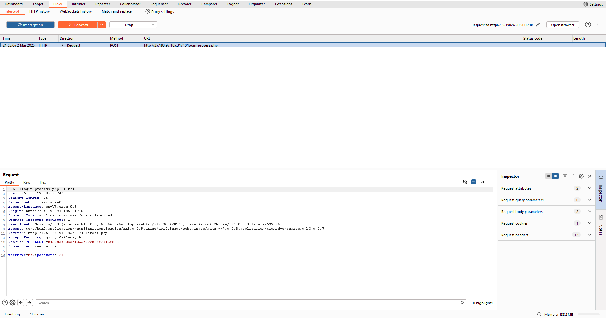
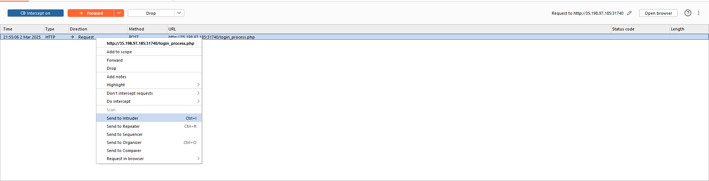
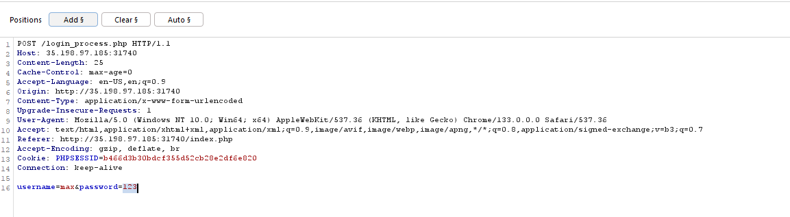
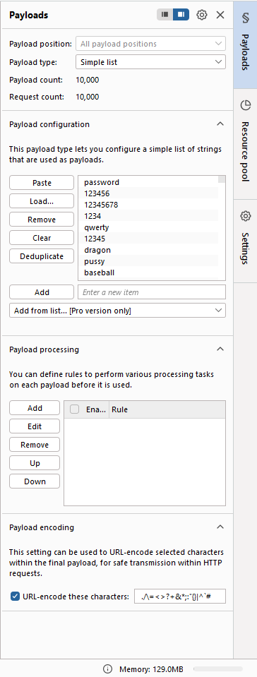
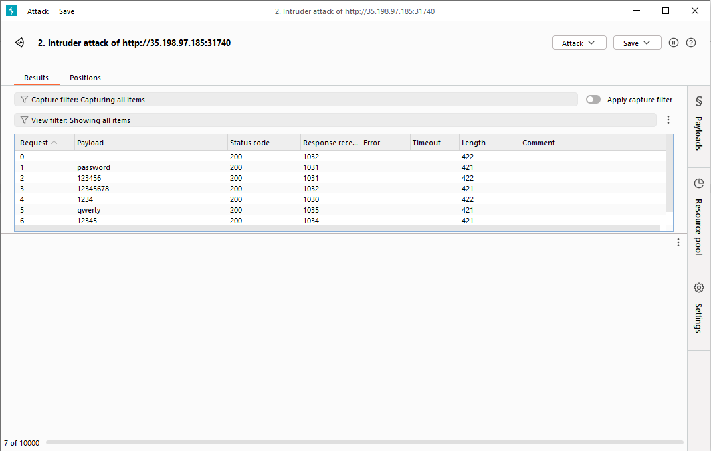

# Formula 1 Web Challenge Write-up

## Challenge Overview
This web challenge features a Formula 1-themed login form where we need to exploit a race condition vulnerability to retrieve the hidden flag.

## Initial Reconnaissance

Upon accessing the website, we're presented with a Formula 1-styled login form:

Testing the login form with random credentials redirects us to `login_process.php`, which returns an error message indicating that the username is incorrect.

Taking a closer look at the image, we notice Max Verstappen (F1 champion) is featured prominently. This gives us our first clue:

1. When attempting to log in with username `max`, the error message changes to "password is not correct"
2. This confirms our first discovery: the valid username is `max`

## Discovering the Vulnerability

While standard analysis of HTML and CSS revealed no useful information, examining the network traffic exposes a critical insight:

- After submitting incorrect credentials, the application briefly routes to `/flag.php` before immediately redirecting to `index.php`
- This suggests a potential race condition vulnerability (cleverly hinted at by the Formula 1 "race" theme)

Our objective becomes clear: we need to exploit this race condition to access the `/flag.php` route before the redirect occurs.

## Exploitation Strategy

To exploit this vulnerability, we'll use Burp Suite to brute force the password while monitoring the network traffic:

1. **Capturing the Request**
   - Intercept the login request using Burp Suite's Proxy
   
   

2. **Setting Up the Intruder**
   - Forward the captured request to Intruder for automated testing
   
   

3. **Configuring Attack Parameters**
   - Select the password field as our injection point by highlighting it and clicking "Add"
   - This tells Burp Suite to target only the password value during the brute force attempt
   
   

4. **Selecting a Wordlist**
   - Navigate to the Payloads tab
   - Load the "10k-most-common.txt" wordlist to systematically test common passwords
   
   

5. **Launching the Attack**
   - Ensure "Sniper Attack" mode is selected (tests one parameter with a single wordlist)
   - Click "Start Attack" to begin the brute force operation
   - The attack monitoring window appears:
   
   

## Exploiting the Race Condition

While Burp Suite is running the attack:
1. Forward the intercepted request in Burp Suite
2. Quickly return to the main page
3. Back in Burp Suite, we notice a request to `/flag.php` - forward this request
4. Return to the web page and refresh

The race condition is successfully exploited! By intercepting the traffic during the brute force attempt, we manage to catch the application during its brief visit to the flag page before redirection occurs. The flag is now displayed on screen:

## Conclusion

This challenge elegantly combines multiple security concepts:
- Username enumeration (discovering `max` as valid)
- Brute force password attacks (using Burp Suite Intruder)
- Race condition vulnerability exploitation (catching the `/flag.php` before redirect)

All of these concepts are wrapped in a thematic Formula 1 presentation, where both the visual elements and the vulnerability itself (race condition) align with the racing theme.