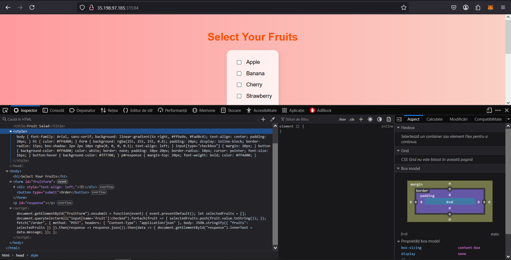
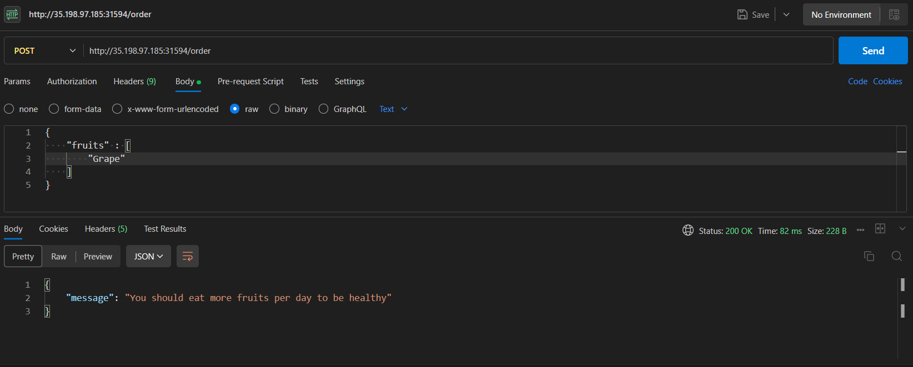
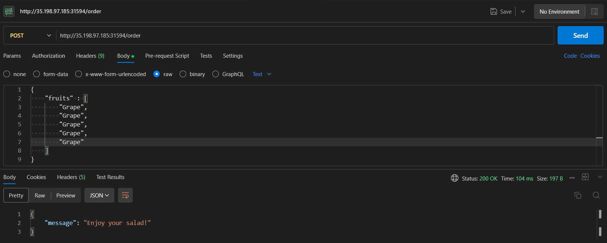
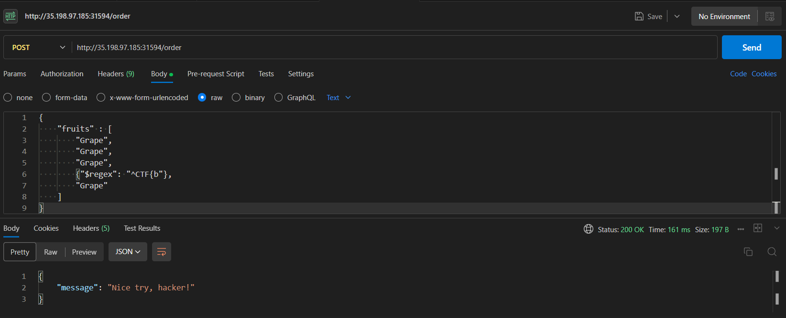
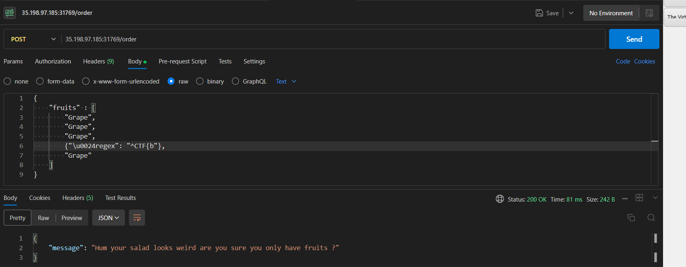
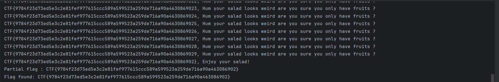

# Fruit-Salad CTF Write-Up

## Challenge Overview
In this CTF we are provided with a web page and the next hint: "This new web application to order fruit salads is really nice, I hope I can add mango into mine."

We go on the page and see some simple check button page to select fruits and a button with the text order.

## Initial Reconnaissance
We will start by analyzing the frontend code of the page by opening the console:


From the picture we see that we have some JavaScript client-side code that takes the selected fruits and sends a POST request to the '/order' endpoint, sending the selected fruits in the body.

## Testing the API
We will open Postman and try different inputs to see how that endpoint reacts.

First we will try sending a fruit to the backend:


The server responds that we should eat more fruits.

Let's try sending more fruits...


When we send 5 fruits we get a different message: "Enjoy your salad".

Basically when we send 5 fruits rather than fewer, we get different messages. This is a key point in solving the problem.

## Understanding the Hint
Let's go back to the hint: "I hope I can add mango into mine". "Mango" is an allusion to "Mongo", so we will try NoSQL injection.

We know that the flag starts with "CTF{" and ends with "}", so in order to get the flag we will try to find every letter one by one.

## The Exploit Approach
The idea is that we will send 4 fruits and one NoSQL injection prompt containing the "CTF{" + one letter at a time.

For example, let's say the first 5 characters in the flag are: "CTF{a"
If we send a JSON like:
```json
{
    "fruits": [
        "Grape",
        "Grape",
        "Grape",
        {"$regex": "^CTF{a"},
        "Grape"
    ]
}
```

This will return the message "Enjoy your salad" because it will find a match for "CTF{a" in the database.

Otherwise if we send:
```json
{
    "fruits": [
        "Grape",
        "Grape",
        "Grape",
        {"$regex": "^CTF{b"},
        "Grape"
    ]
}
```

It will return that we should eat more fruits because it won't find the 4th "fruit" and only count 4 fruits instead of 5.

## Bypassing Security Measures
Now, we have to construct the exact exploit for the NoSQL injection, so we will try to send different payloads with Postman.



Here we see the message: "Nice try, hacker", so we have to find other payloads in order to bypass the system.

We will try to escape the "$" character, as this is the character that causes us problems. To do this, instead of "$" we will try its Unicode value "\u0024".

The payload will look like this:


As we see, now the message changes, which means that the "$" character escapes detection, so now we can try to find the flag letter by letter or digit by digit in order to get the full flag. If a letter or digit is correct then the message "Enjoy your salad" will be displayed, otherwise the message displayed will be that we should eat more fruits.

## Automating the Exploit
To get the flag I constructed a Python script that tries every letter and number. When the message is "Enjoy your salad", it means that the letter or number is correct, so we memorize it into the variable where we construct the flag and go to the next character.

Running this script (see the exploit.py file in this folder) gives us the complete flag character by character.

## Key Takeaways
1. The hint ("mango") pointed to MongoDB/NoSQL injection
2. Understanding the response behavior was crucial (5 fruits vs fewer)
3. Bypassing security filters by using Unicode escape sequences
4. Using regex pattern matching to extract the flag character by character

This challenge demonstrates a common NoSQL injection vulnerability and how improper input validation can lead to data extraction.