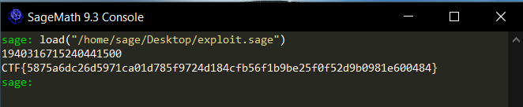

# Mathrix CTF Challenge Write-up

## Challenge Overview

In this challenge, we were presented with a cryptographic problem involving matrix encryption. The challenge provided two files:

1. `mathrix.sage` - The encryption/decryption script
2. `out.txt` - The output containing the encrypted flag and cryptographic parameters

The challenge description included a hint: "pff, who needs a finite body for sure? anyways," suggesting we need to think about the mathematical structure being used.

## Understanding the Encryption

Looking at the provided code in `mathrix.sage`, we can understand the encryption scheme:

```python
from secret import get_generator

p = random_prime(2^64)
A = get_generator(p)

flag = "CTF{...}"
assert flag.startswith("CTF{") and flag.endswith("}") and len(flag[4:-1]) == 64 and all(c in "0123456789abcdef" for c in flag[4:-1])

def encrypt(p, A, Ax, m):
    Zp = Zmod(p)
    M, A, Ax = matrix(Zp, 8, 8), matrix(Zp, A), matrix(Zp, Ax)
    assert len(m) <= 64
    for i in range(len(m)):
        row, col = divmod(i, 8)
        M[row, col] = ord(m[i])
    assert M.is_invertible()
    k = randrange(1, p)

    return A ** k, M * (Ax ** k)

def decrypt(p, x, Ak, C):
    Zp = Zmod(p)
    Ak, C = matrix(Zp, Ak), matrix(Zp, C)
    Akx = (Ak ** x).inverse()
    M = C * Akx
    dec = []
    for i in range(8):
        for j in range(8):
            if M[i,j] == 0:
                return "".join(dec)
            dec.append(chr(M[i,j]))
    return "".join(dec)

x = randrange(1, p)
Ax = A ** x

Ak, C = encrypt(p, A, Ax, flag[4:-1])

print("p =", p)
print("A =", list(A))
print("Ax =", list(Ax))
print("Ak =", list(Ak))
print("C =", list(C))
```

The key components:
- `p`: A random prime number
- `A`: A generator matrix
- `x`: A random exponent (the private key)
- `Ax`: The matrix `A^x` (can be viewed as the public key)
- `k`: Another random exponent used for encryption
- `Ak`: The matrix `A^k`
- `C`: The encrypted message

## Understanding the Problem

From the output file, we have all variables except `x`. To decrypt, we need to:
1. Find `x`
2. Compute `Akx = (Ak^x)^(-1)`
3. Calculate `M = C * Akx` to obtain the original message

The core challenge is finding `x`, which means solving a discrete logarithm problem: given `A` and `Ax = A^x`, find `x`.

## The Solution Approach

The key insight is that calculating discrete logarithms for matrices is computationally intensive, but we can simplify the problem. The hint in the challenge description ("pff, who needs a finite body for sure? anyways,") suggests we should consider transforming our problem into a more manageable form.

We can solve this by:

1. Finding the Jordan normal form of matrix `A`
2. Transforming both `A` and `Ax` into this form
3. Reducing the matrix discrete logarithm to scalar discrete logarithms, which are much easier to compute

### Mathematical Background

The Jordan normal form of a matrix `A` can be represented as:

```
J = P^(-1) * A * P
```

Where `P` is an invertible matrix and `J` is the Jordan normal form of `A`.

Once we have the transformation, we can apply:

```
J^x = P^(-1) * A^x * P
```

This means that finding `x` such that `A^x = Ax` is equivalent to finding `x` such that `J^x = P^(-1) * Ax * P`.

The beauty of the Jordan form is that it's essentially a block diagonal matrix, where each block is upper triangular. This makes the discrete logarithm calculation much simpler.

## Complete Exploit

The complete exploit can be found in this folder

## Executing the Solution

When running the exploit in SageMath, we get:



## Script

```python
#!/usr/bin/env sage

p = 14763417175056989171
A = [(3934133768252467709, 9711753323648742955, 4057538947712413177, 13090260569717578039, 6755530057269299188, 7247218952354544933, 6673878785928818615, 5065087006597340577), (809193092982461252, 12627176165219210989, 767153889566215023, 571460234615269944, 7280109969278516385, 2328702493977949648, 3108784222337939082, 5479777785602975377), (6894448672603483472, 6329267389824899421, 10143262751405557085, 1011170290996749727, 6954231363616586963, 9556901686692614873, 4129049877040244242, 5256515365147071753), (10311150777272097711, 701746981202461220, 11406874654076909758, 4380149002014194591, 8326726204218282617, 5790564227006166245, 12765437031185555431, 8471721479961671611), (11028328055627204580, 13693831665620890676, 1132432238396919105, 2200668664456957216, 10701020514377076580, 10824794119624280142, 12006821520845827453, 7485245284691968546), (13336491058094365230, 14064309882741698831, 3583646573035682688, 2912258912559209914, 11284337034528105054, 12184622525921611098, 4496313336860363043, 12094710648808048697), (9581579314712211619, 1559598537809961197, 3710429153849466791, 8439794050522809089, 10688929641589782289, 8578597674644294575, 1722668868934485909, 10945421307067911394), (6842273819723309068, 10578443475309374153, 9017847806880076889, 11276187354952492913, 4753894044618839595, 11505884469640760980, 10341648728709052794, 1761990770216615514)]
Ax = [(8403850723876965368, 9347688063520705231, 6275409485013171394, 7208693975411409991, 8762069594964957378, 12556558003051901809, 3478151079044972016, 7936282466560936842), (4399944517991372103, 13856703654949637789, 11058631603550304681, 9761307062773886683, 8233925433546689993, 14761116795497464265, 12835702862507428256, 5515060863281861167), (5811321211712515340, 2394242112660991036, 10807798548550402009, 11838940400326993206, 8875548367906665497, 12537232941815186978, 10348505067914580196, 11378164379836799930), (4232923706661751670, 7068050926581334614, 2890063220219904117, 577916661389548134, 602779492250436689, 14742288056032658911, 11090168908293047169, 186449777641404413), (8509607375518280585, 8334583566088830363, 14075064152748125061, 1599689866064110407, 5955979288649432584, 832531400148892125, 5787645333611973131, 815106912408254348), (12550281233711157917, 9644930460389428229, 11897082964763909184, 10404459096704002537, 62292355624296343, 3985105362704273526, 11204790301060563681, 3255580564457538364), (8117573041883315954, 11156569826384272574, 11783447673656633408, 173499848719984744, 11227156009176501151, 12850686001824080831, 5271432311286502414, 1654384489586741478), (527996262262338742, 2086398111674672988, 1902677869991158182, 13195196296264050553, 3084688218448240396, 7032214947665371753, 2064203025689849267, 11975946965091842835)]
Ak = [(757411405122966805, 4459944179884813399, 4746884050313062017, 5631250737874769749, 5706538448557061015, 12790679015538441534, 3327535834836524250, 8185186463392634381), (2935395638025053750, 10204384498967279677, 3296298413002795600, 3878204986063417504, 3095966951594067821, 8517886908524780552, 13107375194539385201, 6301047765840300848), (7283390972216424947, 14708833553873614203, 6661928603250498839, 3671980783903690558, 3755507776999610805, 4921173688686579904, 2968457920939095863, 1193761319827363928), (229051880100688383, 12687550219226095340, 234943672324989749, 4492662919324809170, 3819324128674931412, 11996160500707970888, 8776838841107497933, 4814320658071465745), (4602029534223624461, 9002048856576559617, 2648749412424660003, 7757975037413580475, 14200222868741557288, 11185455410504240030, 13442512054298222324, 8927713659394137956), (13907218385442839376, 2892410063022129106, 12962920643977425008, 13115694573727979736, 8645924345598223602, 6352637057326880846, 10137357963090924719, 7118402809461629057), (12043255173097273579, 7798047187472859802, 7740988015853672620, 9485505007046723803, 7899240887340099774, 13868533966999412119, 12397868800045490029, 4126886778675264754), (8900015364825783974, 5241641150896677766, 8563142568607826016, 10467629774620909560, 6436457749227915574, 12282439462523763344, 8925836872723381379, 4974474109834934395)]
C = [(6915558338014438117, 12451042222793413637, 7638294894367871876, 3104727376757289732, 4626696272775266346, 8250831952881949950, 13746445595364469659, 9391546435106499160), (6722185607026327711, 4466120759690075698, 3483824822402337093, 12180250585561114314, 5923440829659578211, 2513020793841904126, 486318610882807182, 14239620350162455491), (14082023822876615979, 4894578199880285547, 323010225001234150, 10151455083560104160, 558355034479192293, 10398597781386616928, 7858544723784632781, 13198804764201097545), (5052485151018805426, 9177976164909236668, 5375899746992341329, 9035476507930830925, 2348323093251990008, 6365124841513458676, 2703296767829104770, 9204188515838180404), (5702644489369618712, 8928473672659780804, 770312696546965847, 146796199117678429, 11182893829711202793, 7874967079210277384, 1660725768397156217, 1859756437726015908), (11276191028720386727, 885170123560992531, 1335689604375245369, 7423062193287221480, 723665244040114963, 11148447575256943320, 9666107341635200840, 359563205102193652), (13443617071893066944, 5484930276789084632, 8205174542262162209, 14029654962924420615, 8214881934121755827, 13105322972299443047, 4385809884812415941, 1982700230407689942), (293460829524001390, 4284176843651967608, 11541637336975526176, 7283362431241172122, 11252771460374487303, 7717969075392907137, 3052713200960745246, 7891800168131919742)]

A = Matrix(GF(p), A)
Ax = Matrix(GF(p), Ax)
Ak = Matrix(GF(p), Ak)
def discrete_logarithm(M,A):
    k = M.charpoly().splitting_field('x')
    J, P = M.jordan_form(k, transformation=True)
    Q = ~P * A * P
    return discrete_log(Mod(Q[0][0], p), Mod(J[0][0], p))

x = discrete_logarithm(A,Ax)
print(x)

def decrypt(p, x, Ak, C):
    Zp = Zmod(p)
    Ak, C = matrix(Zp, Ak), matrix(Zp, C)
    Akx = (Ak ** x).inverse()
    M = C * Akx
    dec = []
    for i in range(8):
        for j in range(8):
            if M[i,j] == 0:
                return "".join(dec)
            dec.append(chr(M[i,j]))
    return "".join(dec)

flag = decrypt(p,x,Ak,C)
print('CTF{' + flag + '}')

```

## Key Insights

1. The challenge illustrates the concept of matrix discrete logarithms
2. Jordan normal form provides a powerful tool to simplify matrix problems
3. The transformation reduced a complex matrix problem to simpler scalar computations
4. Understanding the mathematical structure of the problem is essential to finding an efficient solution

## Conclusion

This challenge demonstrated an interesting application of linear algebra and number theory in cryptography. By transforming the problem into Jordan normal form, we were able to efficiently solve what would otherwise be a computationally intensive discrete logarithm problem.

The key takeaway is that mathematical transformations can often simplify seemingly complex cryptographic challenges, making them tractable with the right approach.
